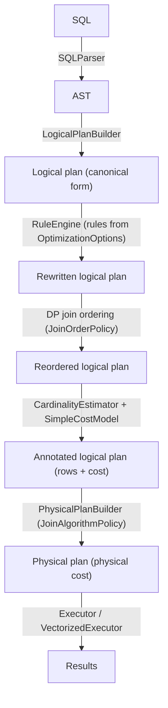
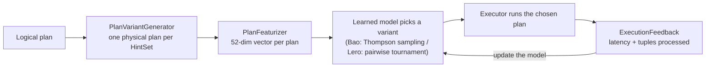
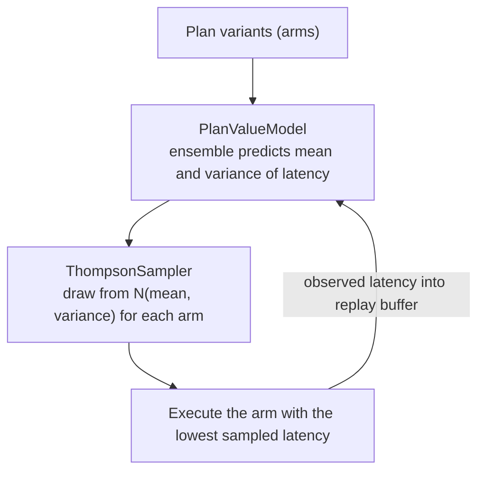
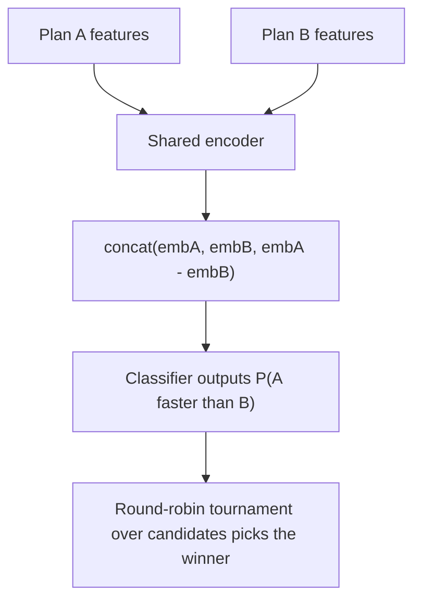
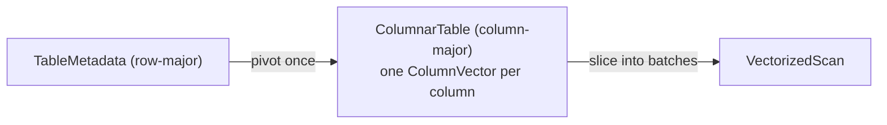
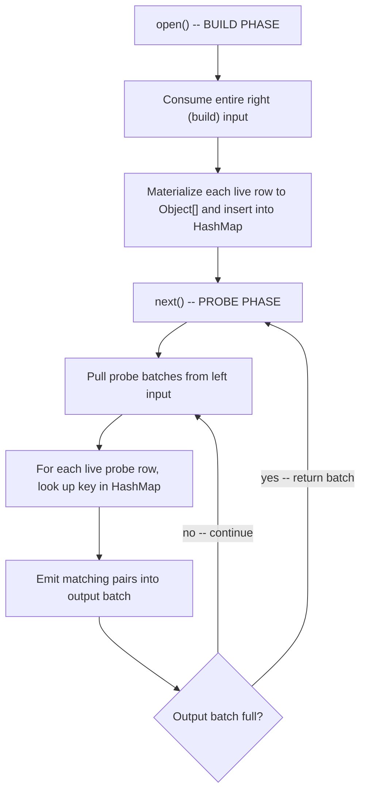

# A query optimizer built from scratch in Java

A from-scratch relational query optimizer in Java, sitting between a toy demo and a production-grade
system. It covers the full traditional pipeline — a CSV-backed catalog, a hand-written SQL parser, logical
and physical plan trees, rule-based rewrites, cost modeling with cardinality estimation, dynamic-programming
join ordering, and execution — then goes further with two execution engines (a Volcano iterator and a
vectorized batch-at-a-time engine), two AI-powered plan-selection strategies (Bao and Lero), and a learned
neural-network cardinality estimator the optimizer can swap in for the heuristic.

Every stage is tied together by one orchestration entry point, `QueryOptimizer`, configured through an
`OptimizationOptions` object.

The project is documented in a blog post series:
[Building a simple query optimizer from scratch, Part 1](https://abhinavtripathi.bearblog.dev/building-simple-query-optimizer-from-scratch-part-1/)

## Highlights

If you are skimming, start with the parts that make this more than a toy:

- **[The unified optimizer pipeline](#the-unified-optimizer-pipeline)** — one entry point (`QueryOptimizer`) and
  one immutable config object (`OptimizationOptions`) drive parsing, rewrites, join ordering, estimation, and
  physical planning, so demos, benchmarks, and the learned optimizers all share the same path.
- **[AI-powered plan selection](#ai-powered-plan-selection)** — Bao (a contextual bandit with Thompson sampling
  over a neural-network ensemble) and Lero (a learning-to-rank pairwise comparator) choose physical plans on top
  of the traditional optimizer.
- **[Vectorized execution](#vectorized-execution)** — a second engine that processes columnar batches of up to
  1024 rows per call, side by side with the classic tuple-at-a-time Volcano engine.
- **[Learned cardinality estimation](#learned-cardinality-estimation)** — a hand-rolled neural network predicts
  row counts and falls back to the heuristic whenever it is unsure.

The milestone-by-milestone build (catalog → parser → rules → cost/cardinality → physical execution) is written
up in **[docs/milestones.md](docs/milestones.md)**; the runnable demos in **[docs/demos.md](docs/demos.md)**; and
a one-line description of every source file in **[docs/file-reference.md](docs/file-reference.md)**.

## The Unified Optimizer Pipeline

All of the optimizer's stages — parsing, rule rewrites, join ordering, estimation, and physical planning — are
tied together by a single entry point, **`QueryOptimizer`**. The milestone build (see
[docs/milestones.md](docs/milestones.md)) wired these stages together ad hoc in each demo; `QueryOptimizer` is the
one orchestration path that the demos, benchmarks, and learned optimizers all share, so they exercise the same
behavior.



### QueryOptimizer

```java
QueryOptimizer optimizer = new QueryOptimizer(catalog);
QueryOptimizer.OptimizationResult result = optimizer.optimize(sql, OptimizationOptions.defaults());

result.initialLogicalPlan();     // as parsed (canonical form)
result.optimizedLogicalPlan();   // after rules + join reordering + annotation
result.physicalPlan();           // executable, annotated with physical cost
```

### OptimizationOptions

A single immutable object controls every knob, so the same query can be planned several ways for comparison (this
is exactly how the learned optimizers generate plan variants):

```java
new OptimizationOptions(
    enablePredicatePushdown,   // boolean
    enableProjectionPushdown,  // boolean
    enableFilterMerge,         // boolean
    joinOrderPolicy,           // PRESERVE_INPUT | DP
    joinAlgorithmPolicy,       // COST_BASED | FORCE_HASH | FORCE_NLJ
    cardinalityModelType);     // HEURISTIC | LEARNED

// A five-argument convenience constructor defaults cardinalityModelType to HEURISTIC.
OptimizationOptions.defaults(); // all rules on, DP join ordering, hash join, heuristic CE
```

| Knob | Values | Effect |
|---|---|---|
| `JoinOrderPolicy` | `PRESERVE_INPUT`, `DP` | Keep the FROM order, or search for the cheapest order via dynamic programming |
| `JoinAlgorithmPolicy` | `COST_BASED`, `FORCE_HASH`, `FORCE_NLJ` | Pick hash vs. nested-loop by physical cost, or force one |
| `CardinalityModelType` | `HEURISTIC`, `LEARNED` | Use the heuristic estimator, or a learned model (see [Learned Cardinality Estimation](#learned-cardinality-estimation)); falls back to heuristic when no model is supplied |

### DP Join Ordering on Real Plans

Dynamic-programming join ordering (the standalone algorithm from `DPJoinOrderer`) is integrated into the pipeline
for connected inner-join trees of three or more tables. The join inputs are extracted as whole single-table
*leaves* — a scan together with any operators pushed onto it, such as a filter — so reordering preserves those
operators rather than dropping them. A join subtree the extractor cannot safely reorder (e.g. a filter spanning two
tables) is left in its input order.

### Statistics-Propagating Cardinality Estimation

`CardinalityEstimator` propagates a `SubtreeStatistics` structure up the plan: alongside the estimated row count it
carries a per-column estimate of the number of distinct values (NDV) and optional min/max. This lets estimates made
higher in the tree reflect the filtering and projection done below them — a filter that pins a column to one value
drops that column's NDV to 1, and a join above it uses the *reduced* NDV instead of reaching back to the original
base-table statistics. (Estimates are keyed by unqualified column name; columns that share a name within one
subtree are a known limitation, documented in the code.)

### Learned Cardinality Estimation

Cardinality estimation is pluggable. `CardinalityModel` is the seam: `HeuristicCardinalityModel` (the default) wraps
the estimator above, while `LearnedCardinalityModel` predicts cardinality with a neural network. The optimizer
selects between them via `OptimizationOptions.cardinalityModelType` and a learned model supplied to the
`QueryOptimizer`:

```java
// Train a model from a workload (exact subplan cardinalities are the labels)
CardinalityTrainingData data = new CardinalityTrainingData(catalog);
List<CardinalityTrainingData.Example> examples = data.generate(workloadLogicalPlans);
SimpleNeuralNetwork net = CardinalityModelTrainer.train(examples, /*epochs*/ 800, /*lr*/ 0.01, /*seed*/ 21);

CardinalityModel learned = new LearnedCardinalityModel(net, data.featurizer(), new HeuristicCardinalityModel(catalog));

// Hand the learned model to the optimizer; LEARNED mode then uses it.
QueryOptimizer optimizer = new QueryOptimizer(catalog, learned);
var options = new OptimizationOptions(true, true, true,
        JoinOrderPolicy.DP, JoinAlgorithmPolicy.COST_BASED, CardinalityModelType.LEARNED);
optimizer.optimize(sql, options);
```

How it works:

- **Featurization** — `CardinalityFeaturizer` turns a logical subplan into a 12-element vector: base-table sizes,
  predicate kinds, join/aggregate counts, and — crucially — the *heuristic estimate itself*. Feeding the heuristic
  in as a feature lets the network learn a **correction** on a sensible baseline, which is what makes it data-efficient
  on small synthetic workloads.
- **Targets in log space** — cardinalities span orders of magnitude, so the network regresses `log(cardinality)` with
  MSE; `estimate()` exponentiates the prediction back to a row count.
- **Training data** — `CardinalityTrainingData` executes every supported subplan of each workload query to obtain its
  *exact* output cardinality as the label, yielding many examples per query.
- **Evaluation** — `QErrorStats` reports the standard scale-free q-error (`max(pred/actual, actual/pred)`); held-out
  tests confirm the trained model generalizes to unseen queries and stays competitive with the heuristic.
- **Fallback everywhere** — the learned model defers to the heuristic for unsupported plan shapes, a missing/untrained
  network, or a non-finite prediction; and the optimizer defers to the heuristic when `LEARNED` is requested but no
  model was supplied. A misbehaving or absent model therefore degrades gracefully rather than failing.

### Logical vs. Physical Costing

Two cost concerns are kept separate:

- **`SimpleCostModel`** costs *logical* plans and drives join ordering (how many rows each operator produces).
- **`PhysicalCostEstimator`** costs the chosen *physical* operators (hash join cost scales with the sum of input
  sizes, nested-loop with their product), and is what cost-based join-algorithm selection compares. The physical
  plan's cost annotations come from this estimator, so the same query's hash and nested-loop variants get
  distinguishable costs.

### Trying It Out

`TraditionalOptimizerDemo` runs one three-way join through the entire pipeline, prints each stage, and contrasts the
strong configuration (all rules, DP ordering, cost-based join selection) against a naive baseline (no rules, input
order, forced nested-loop): lower estimated cost, identical results.

```bash
mvn -q compile exec:java -Dexec.mainClass=org.query.optimizer.TraditionalOptimizerDemo
```

## AI-Powered Plan Selection

The optimizer includes two learned plan selection strategies that sit on top of the
existing optimizer pipeline rather than replacing it. Both generate alternative physical
plans for a query (using different "hint sets"), featurize them into numeric vectors,
and use a trained model to pick the best one.

Both strategies share the same loop and the same shared infrastructure (below); they differ only in *how the
model picks a variant* (step **D**) — Bao via Thompson sampling, Lero via a pairwise tournament:



### Shared Infrastructure

#### HintSet

An immutable configuration that controls which optimization rules are applied, whether
the physical plan builder prefers hash or nested-loop joins, and the join-order policy.

```java
// Six predefined hint sets (the "arms" in Bao's bandit terminology)
HintSet.DEFAULT           // all rules, hash join, DP join ordering
HintSet.FORCE_NLJ         // all rules, nested-loop join forced
HintSet.NO_PUSHDOWN       // skip predicate/projection pushdown
HintSet.NO_PUSHDOWN_NLJ   // skip pushdown, force NLJ
HintSet.MINIMAL_OPT       // no optimization rules at all
HintSet.PRESERVE_ORDER    // all rules, hash join, but keep the input join order (no DP)

List<HintSet> arms = HintSet.allHintSets(); // all six
```

Join order is a bandit dimension alongside the rule and join-algorithm knobs: `PRESERVE_ORDER` lets the model learn
when keeping the written (FROM) order beats the cost-based DP order. `OptimizationOptions.fromHintSet` maps a hint
set's knobs — including its `JoinOrderPolicy` — onto the optimizer.

#### PlanVariantGenerator

Generates one physical plan per hint set for a given logical plan, deduplicating
structurally identical plans before returning.

```java
PlanVariantGenerator gen = new PlanVariantGenerator(catalog, costModel);
Map<HintSet, PhysicalNode> variants = gen.generateVariants(logicalPlan, HintSet.allHintSets());
// A join query typically yields 2-4 distinct physical plans
```

#### PlanFeaturizer

Converts a physical plan tree into a fixed-length `double[]` suitable for neural
network input. Uses BFS traversal across up to 8 operator slots (6 features each) plus
4 global features (depth, total cost, total rows, operator count) — 52 elements in all.
Operator types include scan, filter, project, hash/nested-loop join, **and aggregate**;
the eight slots cover deeper plans such as a three-way join with pushed-down filters and
an aggregate.

```java
double[] features = new PlanFeaturizer().featurize(physicalNode);
// features.length == PlanFeaturizer.FEATURE_DIM (52)
```

The Bao and Lero network input sizes derive from `PlanFeaturizer.FEATURE_DIM`, so they
resize automatically if the featurization changes.

#### WorkloadGenerator / DataGenerator

`WorkloadGenerator` generates random SQL queries across five shapes (simple scan,
filtered scan, 2-way join, 3-way join, join + aggregation). `DataGenerator` populates
a catalog with synthetic `customers`, `orders`, and `products` tables at configurable
scale.

```java
DataGenerator.generate(catalog, 10);   // ~10K rows per table
WorkloadGenerator wl = new WorkloadGenerator(catalog);
List<ParsedQuery> queries = wl.generateWorkload(200);
```

---

### Hand-Rolled Neural Network

A minimal feedforward MLP with backpropagation, used by both Bao and Lero.

#### SimpleNeuralNetwork

Configurable layer sizes, Xavier uniform weight initialization, ReLU hidden layers,
linear output, and online SGD. Supports save/load to plain-text files.

```java
// Bao's value network, for example, is FEATURE_DIM (52) -> 64 -> 32 -> 1
SimpleNeuralNetwork net = new SimpleNeuralNetwork(new int[]{PlanFeaturizer.FEATURE_DIM, 64, 32, 1}, 0.001);

// Train on (features, target) pairs
net.trainStep(planFeatures, new double[]{observedLatency}, LossFunction.mse());

// Predict
double predicted = net.predict(planFeatures)[0];

// Save / load
net.save("model.txt");
SimpleNeuralNetwork loaded = SimpleNeuralNetwork.load("model.txt");
```

#### LossFunction / ActivationFunction

`LossFunction` provides `mse()` (for latency regression) and `bce()` (for pairwise
classification). `ActivationFunction` provides `relu`, `reluDerivative`, `sigmoid`,
and `sigmoidDerivative` as static methods.

---

### Bao: Bandit-Based Plan Steering

Bao treats each hint set as a bandit "arm" and uses Thompson Sampling over an
ensemble of neural networks to select the arm expected to produce the fastest plan.
After executing the chosen plan, the observed latency is fed back to improve the model.



#### PlanValueModel

An ensemble of three neural networks that predicts both mean and variance of latency
for a plan. Retrains periodically on a growing replay buffer, with each ensemble
member trained on a different bootstrap sample.

```java
PlanValueModel model = new PlanValueModel(new Random(42));

// Add observed execution feedback
model.addFeedback(new ExecutionFeedback(sql, hintSet, features, latencyMs, tuples, ...));

// Predict latency with uncertainty
PredictionWithUncertainty p = model.predict(planFeatures);
// p.mean() and p.variance()
```

#### ThompsonSampler

Draws from the `N(mean, variance)` posterior for each plan and returns the arm
with the lowest sampled predicted latency.

#### BanditOptimizer

Orchestrates the full Bao loop: generate variants -> featurize -> Thompson sample ->
execute -> record feedback.

```java
BanditOptimizer bao = new BanditOptimizer(catalog);
ExecutionResult result = bao.optimizeAndExecute(logicalPlan);

// Run an entire workload and collect per-query metrics
List<BanditOptimizer.QueryMetrics> metrics = bao.runWorkload(workload);
```

#### BaoDemo

Runs a 200-query demo showing the learning curve (cumulative latency over time),
arm selection histogram, per-query latency breakdown, and Bao vs. default comparison.

---

### Lero: Learning-to-Rank Plan Selection

Lero avoids predicting absolute latency. Instead, it trains a pairwise comparator
that learns to say "plan A is faster than plan B" -- a strictly easier learning task.



#### PairwiseComparator

A Siamese neural network: both plans are encoded by the same shared encoder
(`FEATURE_DIM -> 64 -> 32`), the resulting embeddings are concatenated with their difference
(`96`-dim), and a classifier (`96 -> 32 -> 1`) outputs P(plan A is faster than plan B).

```java
PairwiseComparator comparator = new PairwiseComparator();

// Train on a labeled pair
double loss = comparator.trainStep(featuresA, featuresB, /* aIsFaster= */ true);

// Compare two plans
double prob = comparator.compare(featuresA, featuresB);  // > 0.5 -> A predicted faster

// Pick the best plan from a set via round-robin tournament
int bestIdx = comparator.tournamentSelect(List.of(feat0, feat1, feat2, feat3));

// Evaluate on held-out pairs
double accuracy = comparator.evaluateAccuracy(testPairs);
```

#### PlanExplorer

Generates training data by executing all plan variants for a query and recording
every pairwise comparison. Produces both directions of each pair for balanced training.

#### LeroOptimizer

During a warm-up period it uses the cost model and runs the `PlanExplorer` to
accumulate training pairs. Once warm-up is complete, it uses `tournamentSelect`
for plan selection and re-explores on 10% of queries for continued learning.

```java
LeroOptimizer lero = new LeroOptimizer(catalog);
ExecutionResult result = lero.optimizeAndExecute(logicalPlan);

// Run a full workload
List<LeroOptimizer.QueryMetrics> metrics = lero.runWorkload(workload);
// QueryMetrics includes: result, selectedPlan, usedCostModel flag
```

#### LeroDemo

Runs a 200-query demo with five output sections: overall summary, learning curve at
query checkpoints, pairwise comparator accuracy over time, Lero vs. cost-model
disagreement analysis, and warm-up vs. warm-phase statistics.

---

### Comparison Benchmark

#### LearnedOptimizerBenchmark

Runs the same workload through all four strategies -- DEFAULT, ORACLE, BAO, and LERO --
and produces both per-query and aggregate metrics. The ORACLE strategy executes every
distinct plan variant and keeps the cheapest one, giving the theoretical performance
ceiling no strategy can beat.

Metrics computed per strategy:

| Metric | Description |
|---|---|
| Total latency | Sum of all per-query execution times |
| Regret vs. oracle | `total / oracleTotal`; 1.0 = perfect |
| Learning speed | First query at which rolling avg <= 1.2x oracle rolling avg |
| P95 / P99 tail latency | 95th and 99th percentile per-query latency |

Cross-strategy metric: **Bao-Lero agreement rate** -- fraction of queries where both
strategies chose a plan with the same estimated cost. Used as a proxy for structural
plan identity (see Javadoc for full rationale).

```java
LearnedOptimizerBenchmark bench = new LearnedOptimizerBenchmark(catalog);
BenchmarkResults results = bench.run(workload);

results.defaultTotal();                         // total ms for DEFAULT
results.oracleTotal();                          // total ms for ORACLE (ceiling)
results.baoTotal();                             // total ms for BAO
results.leroTotal();                            // total ms for LERO
results.baoLeroAgreementRate();                 // 0.0-1.0
results.baoMetrics().regretVsOracle();          // e.g. 1.15 = 15% above oracle
results.leroMetrics().learningSpeedQuery();     // query index where Lero converged
```

#### BaoVsLeroDemo

The showpiece combined demo. Generates a 300-query workload, runs all four strategies
through `LearnedOptimizerBenchmark`, and prints a seven-section report:

1. **Overview** -- one-row summary per strategy (total ms, regret ratio, P95/P99, convergence query)
2. **Learning curves** -- cumulative latency at queries 50/100/150/200/250/300 for all four strategies
3. **Bao deep-dive** -- arm selection counts split into early/mid/late thirds; arm diversity per
   period as a proxy for the exploration to exploitation transition
4. **Lero deep-dive** -- pairwise comparator accuracy at queries 50/100/200/300 (trained
   incrementally), plus warm-up vs. warm-phase latency breakdown
5. **Head-to-head** -- per-query win/loss between Bao and Lero, agreement rate, and shared failure
   modes (queries where both strategies underperformed the default)
6. **Cost-based join-algorithm mix** -- how the cost model distributes hash vs. nested-loop joins
   across the workload
7. **Wall-clock distribution** -- each strategy's total latency as a median and IQR over a handful of
   timed repeats (after a warm-up pass). Sections 1-6 are seeded and reproduce identically on any
   machine; this is the only machine-dependent section, so it is reported as a distribution rather
   than a single noisy total

```bash
mvn -q exec:java -Dexec.mainClass=org.query.optimizer.learned.benchmark.BaoVsLeroDemo
```

---

## Vectorized Execution

### Overview

Alongside the Volcano iterator model, the optimizer includes a second execution engine that processes data in
batches rather than one tuple at a time. The two engines accept the same optimized logical plan and produce the
same `ExecutionResult`, making it straightforward to compare their outputs.

**Why vectorized execution?**

The Volcano model calls `next()` once per tuple. Each call crosses operator boundaries, which adds up to millions
of virtual dispatch events for large tables. Vectorized execution amortizes that overhead by returning a batch of
up to 1024 rows per `next()` call. Fewer calls means less interpreter overhead and, more importantly, tighter
inner loops that the JIT can autovectorize over typed primitive arrays.

### Columnar Storage

#### ColumnVector

The fundamental storage unit. Instead of boxing values into `Object[]`, each column is stored as a typed
primitive array chosen at construction time:

| Data type | Backing array |
|-----------|---------------|
| INTEGER   | `int[]`       |
| FLOAT     | `float[]`     |
| VARCHAR   | `String[]`    |

Null tracking uses a separate `boolean[]` so it stays off the hot path when iterating non-null columns.
Typed getters (`getInt`, `getFloat`, `getString`) avoid boxing entirely on the read path.

```java
ColumnVector v = ColumnVector.create(DataType.INTEGER, 1024);
v.putInt(0, 42);
int val = v.getInt(0);   // no boxing, direct array access
```

#### ColumnBatch

A horizontal slice of a table: one `ColumnVector` per schema column, all sharing the same logical row count.
This is the unit exchanged between operators -- analogous to the single `Object[]` in the Volcano model, but
carrying up to `DEFAULT_BATCH_SIZE` (1024) rows per call.

```java
// DEFAULT_BATCH_SIZE = 1024 -- same as CockroachDB, DuckDB, and Velox
ColumnBatch batch = new ColumnBatch(schema);
batch.setSize(rowCount);
ColumnVector priceCol = batch.getVector("price");
```

**Selection vectors.** Rather than physically removing non-qualifying rows after a filter, a batch carries an
optional `int[]` selection vector listing the indices of live rows. Downstream operators iterate only those
indices:

```java
int[]  sv   = batch.getSelectionVector();
int    size = batch.getSelectionSize();
for (int i = 0; i < size; i++) {
    int row = sv[i];
    // read batch.getVector(col).getInt(row)
}
```

This avoids all data movement. The column arrays are never compacted; the branch predictor handles the tight
loop cleanly.

#### ColumnarTable

The existing `TableMetadata` stores rows in row-major form. `ColumnarTable` performs a one-time pivot to
column-major layout on first access, then caches the result in the catalog.



A filter on `price` only needs to load `price`'s `float[]` into cache. In row-oriented storage, every cache
line also pulls in `id`, `name`, and every other column the filter ignores.

---

### VectorizedOperator Interface

The vectorized counterpart of the Volcano `Iterator`. The lifecycle is identical -- `open / next / close` --
but `next()` returns a `ColumnBatch` instead of a single tuple.

```java
VectorizedOperator plan = new VectorizedPlanBuilder(catalog).build(logicalPlan);
plan.open();
ColumnBatch batch;
while ((batch = plan.next()) != null) {
    // process up to 1024 rows per iteration
}
plan.close();
```

Operators reuse the same `ColumnBatch` instance across `next()` calls (allocated once in `open()`). Callers
that need to retain a batch past the next call must copy the relevant data out first.

---

### Operators

#### VectorizedScan

Reads a `ColumnarTable` and emits one batch per `next()` call by slicing each column vector into the output
batch using `System.arraycopy`. No selection vector is set -- all rows in the batch are live.

#### VectorizedFilter

Evaluates a predicate over an entire batch using `VectorizedExpressionEvaluator.evaluateFilter`, which
populates a selection vector rather than copying qualifying rows. The filter never moves data; it only marks
which rows survive.

Stacking two `VectorizedFilter` nodes is equivalent to a single AND predicate with no extra work:
`evaluateFilter` automatically intersects with any existing selection vector on the incoming batch.

When every row in a batch is eliminated, the operator silently fetches the next batch from its input rather
than surfacing an empty batch to the caller.

#### VectorizedHashJoin

A two-phase inner equi-join (single join column):



The build phase runs entirely inside `open()`, making the probe phase a pure streaming loop. A state machine
preserves position across `next()` calls so a match stream that spans more than one output batch is handled
correctly.

#### VectorizedAggregate

A blocking operator with two clearly separated phases:

1. **Accumulation** -- the first `next()` call drains all input batches. For each live row, the group key is
   extracted as a `List<Object>` and used to look up (or create) an `AggregateAccumulator` array in a
   `LinkedHashMap`. Each accumulator (`CountAccumulator`, `SumAccumulator`, etc.) is updated in-place.
   Selection vectors on input batches are fully respected.

2. **Emission** -- subsequent `next()` calls iterate the group map and write results into output batches of
   up to 1024 rows. A `LinkedHashMap` preserves insertion order for deterministic output.

Supported aggregate functions: `COUNT`, `SUM`, `AVG`, `MIN`, `MAX`. Output type inference:

| Function        | Output type                    |
|-----------------|--------------------------------|
| `COUNT`         | INTEGER                        |
| `AVG`           | FLOAT                          |
| `SUM/MIN/MAX`   | Same as input column type      |

#### VectorizedProject

Selects a subset of columns from each input batch by swapping `ColumnVector` references in the output batch,
not by copying data. The selection vector from the input batch (if any) is preserved unchanged.

---

### VectorizedPlanBuilder

Converts the same `LogicalNode` tree used by `PhysicalPlanBuilder` into a tree of `VectorizedOperator`s.
Both builders accept the same input, which makes side-by-side comparison straightforward:

```java
LogicalNode logicalPlan = new LogicalPlanBuilder(catalog).build(ast);
logicalPlan = ruleEngine.optimize(logicalPlan);

// Volcano path
PhysicalNode    volcanoPlan  = new PhysicalPlanBuilder(catalog).build(logicalPlan);
ExecutionResult volcanoResult = new Executor().execute(volcanoPlan);

// Vectorized path
VectorizedOperator vecPlan   = new VectorizedPlanBuilder(catalog).build(logicalPlan);
ExecutionResult    vecResult  = new VectorizedExecutor().execute(vecPlan);

// Same result type -- directly comparable
assertEquals(volcanoResult.tuples(), vecResult.tuples());
```

Supported conversions:

| Logical operator   | Vectorized operator      |
|--------------------|--------------------------|
| `LogicalScan`      | `VectorizedScan`         |
| `LogicalFilter`    | `VectorizedFilter`       |
| `LogicalProject`   | `VectorizedProject`      |
| `LogicalJoin`      | `VectorizedHashJoin`     |
| `LogicalAggregate` | `VectorizedAggregate`    |

### VectorizedExecutor

Drives the operator tree and materializes results into the same `ExecutionResult` used by the Volcano
`Executor`. When a batch carries a selection vector, only the selected rows are emitted.

```java
VectorizedExecutor exec = new VectorizedExecutor();
ExecutionResult result = exec.execute(plan);

// Or print a formatted result table to stdout
exec.executeAndPrint(plan);
```

---

## Under the hood: the traditional pipeline

The learned and vectorized features above sit on top of a complete, conventional optimizer. Each stage is
summarized here; the full walkthrough — with code excerpts and worked examples — lives in
**[docs/milestones.md](docs/milestones.md)**.

- **Catalog & schema** — a CSV-backed `Catalog` loads tables, infers schemas, and collects per-column
  statistics (NDV, min/max, null counts) and histograms.
  → [Milestone 1](docs/milestones.md#milestone-1-foundation--catalog)
- **Parser & logical plans** — a hand-written recursive-descent `SQLParser` produces an AST that lowers into a
  canonical-form logical plan (AND-predicates split into one filter per conjunct).
  → [Milestone 2](docs/milestones.md#milestone-2-parsing--logical-plans)
- **Rule-based rewrites** — `PredicatePushdown`, `ProjectionPushdown`, and `FilterMerge` run to fixpoint in a
  bottom-up `RuleEngine`.
  → [Milestone 3](docs/milestones.md#milestone-3-rule-engine--optimization)
- **Cost & cardinality** — `SimpleCostModel` prices logical plans from cardinality estimates; the
  `CardinalityEstimator` combines NDV-based selectivity, histogram-based range selectivity, and cost
  calibration. The statistics-propagating and logical-vs-physical refinements are covered in
  [the pipeline section](#statistics-propagating-cardinality-estimation) above.
  → [Milestone 3](docs/milestones.md#milestone-3-rule-engine--optimization)
- **Join ordering** — dynamic-programming join ordering searches for the cheapest order of connected inner
  joins (see [DP Join Ordering on Real Plans](#dp-join-ordering-on-real-plans)).
- **Physical execution** — `PhysicalPlanBuilder` lowers the optimized logical plan into a Volcano iterator tree
  (`open`/`next`/`close`), choosing hash vs. nested-loop joins by physical cost.
  → [Milestone 4](docs/milestones.md#milestone-4-physical-execution)

## Demos

Every stage ships with a runnable demo that prints its work to stdout. The full catalogue — expected output and
example queries for each — is in **[docs/demos.md](docs/demos.md)**. The two headline ones:

- **`TraditionalOptimizerDemo`** — runs one three-way join through the entire traditional pipeline and contrasts
  the strong configuration (all rules, DP ordering, cost-based join selection) against a naive baseline. See
  [Trying It Out](#trying-it-out).
- **`BaoVsLeroDemo`** — the AI showpiece: a 300-query head-to-head between DEFAULT, ORACLE, Bao, and Lero. See
  [Comparison Benchmark](#comparison-benchmark).

## Run Tests

These runs automatically when you build with Maven without skipping tests,

- FoundationTest contains end-to-end tests for Milestone 1 features
- ParsingAndLogicalPlansTest contains end-to-end tests for Milestone 2 features
- RuleEngineAndOptimizationsTest contains end-to-end tests for Milestone 3 features
- LearnedOptimizerTest contains end-to-end tests for the AI plan selection features
  (featurization, MLP training, Bao/Lero correctness, and benchmark invariants)
- The `learned/cardinality` test package covers the learned cardinality estimator: training-data
  labelling, training reducing q-error, optimizer mode selection/fallback, and held-out generalization
- TraditionalOptimizerPipelineTest exercises the full traditional pipeline (rules → DP join ordering →
  cost-based physical planning → execution) against a naive baseline


## Project layout & further reading

- **[docs/milestones.md](docs/milestones.md)** — the milestone-by-milestone build (catalog → parser → rules →
  cost/cardinality → physical execution), with code excerpts and worked examples.
- **[docs/demos.md](docs/demos.md)** — every runnable demo and what it prints.
- **[docs/file-reference.md](docs/file-reference.md)** — a one-line description of every source file.
- **Blog series** — [Building a simple query optimizer from scratch](https://abhinavtripathi.bearblog.dev/building-simple-query-optimizer-from-scratch-part-1/).
