# A query optimizer built from scratch in Java

A from-scratch implementation of a relational query optimizer in Java, sitting between a toy demo and a
production-grade system. It covers the full pipeline: a CSV-backed catalog, a hand-written SQL parser, logical and
physical plan trees, rule-based optimization (predicate/projection pushdown, filter merge), cost modeling with
cardinality estimation that propagates per-column distinct-value estimates, dynamic-programming join ordering,
histogram-based selectivity, cost calibration, cost-based join-algorithm selection, two execution engines (Volcano
iterator and vectorized batch-at-a-time), two AI-powered plan selection strategies (Bao and Lero), and a learned
neural-network cardinality estimator that the optimizer can swap in for the heuristic.

All of these stages are tied together by a single orchestration entry point, `QueryOptimizer`, configured through an
`OptimizationOptions` object — see [The Unified Optimizer Pipeline](#the-unified-optimizer-pipeline) below.

The project is documented in a blog post series:
[Building a simple query optimizer from scratch, Part 1](https://abhinavtripathi.bearblog.dev/building-simple-query-optimizer-from-scratch-part-1/)

## Milestone 1: Foundation & Catalog

### Overview

Milestone 1 establishes the clean architectural foundation for the query optimizer. It implements the catalog layer,
core interfaces, and supporting infrastructure.

### Catalog System

**Key Features:**

- Central metadata registry for all tables
- CSV file loading with automatic schema detection
- Statistics collection (NDV, min/max, null counts)
- In-memory table storage

**Usage Example:**

```java
Catalog catalog = new Catalog();
TableMetadata customers = catalog.loadTableFromCSV("customers", "customers.csv");

// Query metadata
long rowCount = customers.getRowCount();
Schema schema = customers.getSchema();
ColumnStats stats = customers.getColumnStats("city");

// Access data
Object[] row = customers.getRow(0);
Object value = customers.getValue(0, "name");
```

**CSV Format:**

```
id:INTEGER,name:VARCHAR,age:INTEGER
1,Alice,30
2,Bob,25
```

### Core Interfaces

#### LogicalNode

Base class for logical plan operators with:

- Child management (`getChildren()`, `withChildren()`)
- Annotation system for optimizer metadata
- Pretty printing with cost/cardinality display

#### PhysicalNode

Base class for physical operators with:

- Similar structure to LogicalNode
- `estimateCost()` method for operator costing

#### Rule

Interface for optimization transformations:

```java
interface Rule {
    String getName();

    boolean matches(LogicalNode node);

    LogicalNode apply(LogicalNode node);
}
```

#### CostModel

Interface for cost and cardinality estimation:

```java
interface CostModel {
    double estimateCost(LogicalNode node);

    long estimateCardinality(LogicalNode node);

    CostConfig getConfig();
}
```

Includes configurable `CostConfig` with tunable constants:

- `PAGE_COST` - Cost to read/write a page
- `TUPLE_COST` - Cost to process a tuple
- `PAGE_SIZE` - Tuples per page

#### Iterator

Volcano-model execution interface:

```java
interface Iterator {
    void open();        // Initialize

    Object[] next();    // Get next tuple

    void close();       // Clean up
}
```

### Expression System

Shared expression tree for predicates and projections:

**Supported Expressions:**

- `ColumnRef` - Column references (qualified or unqualified)
- `Literal` - Integer, float, and string literals
- `BinaryOp` - Comparison (=, !=, >, <, >=, <=) and logical (AND, OR) operators

**Example:**

```java
// Build: age > 25 AND name = 'Alice'
Expression expr = new BinaryOp(Operator.AND,
                new BinaryOp(Operator.GT, new ColumnRef("age"), new Literal(25)),
                new BinaryOp(Operator.EQ, new ColumnRef("name"), new Literal("Alice"))
        );

// Evaluate against a row
Object result = expr.evaluate(row, schema);

// Generate SQL string
String sql = expr.toSqlString();  // "(age > 25) AND (name = 'Alice')"
```

### Plan Annotations

Both logical and physical nodes support annotations for optimizer metadata:

```java
node.setEstimatedRows(1000);
node.setEstimatedCost(25.5);
node.setAnnotation("selectivity", 0.1);

long rows = node.getEstimatedRows();
double cost = node.getEstimatedCost();
```

Pretty printing automatically displays annotations:

```
+-- Scan[products] [rows=7, cost=0.07]
```

## Milestone 2: Parsing & Logical Plans

### Overview

Milestone 2 implements SQL parsing, AST generation, and conversion to canonical logical plans. This establishes the
foundation for query optimization by creating a clean, normalized representation of queries.

### SQL Parser

**Supported SQL Syntax:**

```sql
SELECT column1, column2, aggregate(column)
FROM table1
    [INNER JOIN table2 ON condition]
    [INNER JOIN table3 ON condition]
WHERE condition
GROUP BY column1, column2
```

**Features:**

- Hand-written recursive descent parser
- Regex-based tokenization
- Support for qualified columns (table.column)
- Binary operators: =, !=, >, >=, <, <=
- Logical operators: AND, OR
- Aggregate functions: COUNT, SUM, AVG, MIN, MAX
- Literals: integers, floats, strings

**Explicitly NOT Supported:**

- Subqueries, UNION, DISTINCT
- Outer joins (LEFT, RIGHT, FULL)
- Complex expressions (arithmetic, functions, CASE)
- ORDER BY, LIMIT, HAVING

(Multi-way inner joins *are* supported: dynamic-programming join ordering handles up to 10 tables.)

### AST Classes

Complete Abstract Syntax Tree hierarchy in `AST.java`:

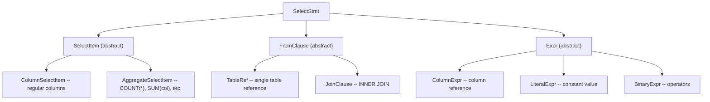

**Usage Example:**

```java
SQLParser parser = new SQLParser();
AST.SelectStmt ast = parser.parse("SELECT name FROM products WHERE price > 100");
System.out.println(ast); // Pretty-prints the AST
```

### Logical Operators

Five concrete logical operators representing relational algebra:

1. **LogicalScan** - Read from a table (leaf node)
2. **LogicalFilter** - Apply predicate (WHERE)
3. **LogicalProject** - Select columns (SELECT list)
4. **LogicalJoin** - Combine relations (JOIN)
5. **LogicalAggregate** - Group and aggregate (GROUP BY)

### LogicalPlanBuilder (Visitor Pattern)

Converts AST to logical plan with **canonical form enforcement**:

**Canonical Form Rules:**

1. **Split AND predicates** into separate Filter nodes
    - Input: `WHERE a = 1 AND b = 2 AND c = 3`
    - Output: 3 separate Filter nodes (one per predicate)
2. **Separate Filter nodes** from other operators
3. **Normalized expressions** (no redundancy)

**Why Canonical Form?**

- **Simplifies rules**: Each rule can assume a specific structure
- **Enables optimization**: Easier to move/reorder filters
- **Consistent representation**: Same query always produces same tree shape

**Example:**

```java
Catalog catalog = new Catalog();
catalog.loadTableFromCSV("products", "products.csv");

SQLParser parser = new SQLParser();
LogicalPlanBuilder builder = new LogicalPlanBuilder(catalog);

String sql = "SELECT name FROM products WHERE category = 'Electronics' AND price > 100";
AST.SelectStmt ast = parser.parse(sql);
LogicalNode plan = builder.build(ast);

// Plan structure (canonical form):
// Project[name]
// +-- Filter[(price > 100)]
//     +-- Filter[(category = 'Electronics')]
//         +-- Scan[products]
```

## Milestone 3: Rule Engine & Optimization

### Overview

Milestone 3 implements the core optimization engine: rule-based transformations, cost modeling, and cardinality
estimation. This is where query plans get transformed into more efficient equivalent plans.

### Rule Engine with Fixpoint Iteration

**Architecture:**

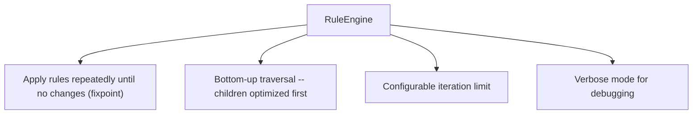

**Key Algorithm:**

```
while (not fixpoint && iterations < max) {
    for each rule:
        apply rule exhaustively to entire tree
    if (no changes):
        break  // fixpoint reached
}
```

**Usage:**

```java
List<Rule> rules = Arrays.asList(
        new PredicatePushdown(),
        new ProjectionPushdown(),
        new FilterMerge()
);

RuleEngine engine = new RuleEngine(rules, maxIterations);
LogicalNode optimizedPlan = engine.optimize(initialPlan);
```

### Optimization Rules

#### 1. Predicate Pushdown

**Pattern:** `Filter -> Join`
**Transform:** Push filter to appropriate join input

**Algorithm:**

1. Analyze which tables the predicate references
2. If predicate references only left table -> push to left child
3. If predicate references only right table -> push to right child
4. If predicate references both -> keep above join

**Before:**

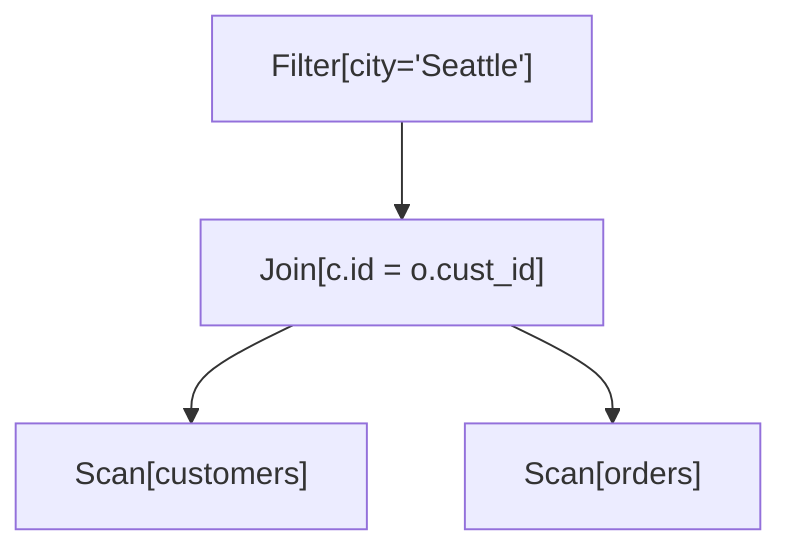

**After:**

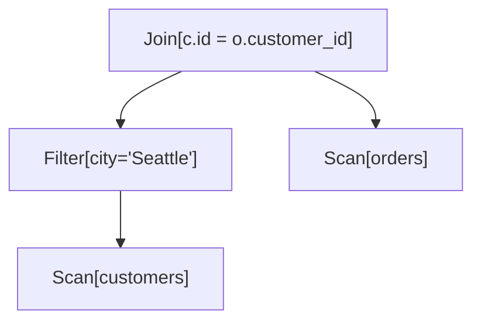

**Why it works:** For inner joins, filtering before or after produces same result, but filtering earlier reduces
intermediate result size.

#### 2. Projection Pushdown

**Pattern:** `Project -> Filter`
**Transform:** Swap to `Filter -> Project`

**Safety Check:**

- Ensure filter predicate doesn't reference columns eliminated by projection
- Only swap if safe

**Before:**

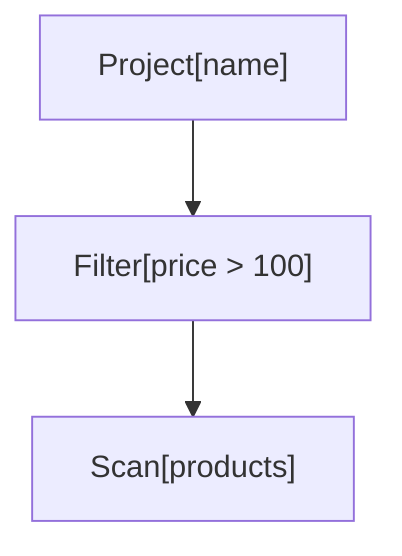

**After:**

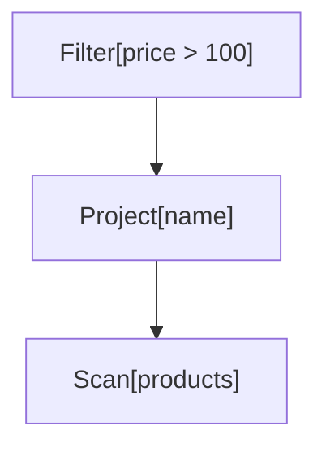

**Why it works:** Filters don't change schema, and filtering first reduces data volume.

#### 3. Filter Merge

**Pattern:** `Filter -> Filter`
**Transform:** Single filter with AND predicate

**Before:**

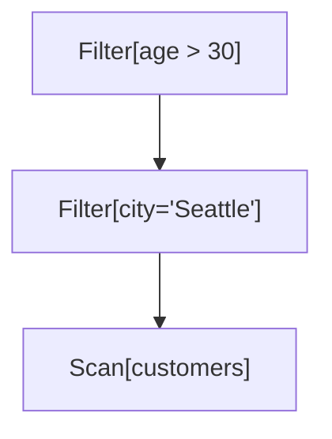

**After:**

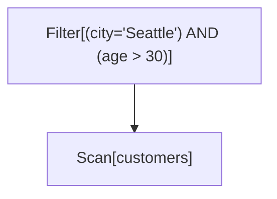

**Why it works:** Reduces operator overhead during execution. This reverses the canonical form after optimization is
complete.

### Cost Model

**Formula:**

```
Cost = I/O_cost + CPU_cost

I/O_cost  = pages_read * PAGE_COST
CPU_cost  = tuples_processed * TUPLE_COST

pages = ceil(rows / PAGE_SIZE)
```

**Configurable Parameters:**

```java
CostConfig {
    PAGE_COST = 1.0         // Cost to read one page
    TUPLE_COST = 0.01       // Cost to process one tuple
    PAGE_SIZE = 100         // Tuples per page
    COMPARISON_COST = 0.001 // Cost per comparison
    HASH_COST = 0.005       // Cost to hash one tuple
}
```

**Operator Costs:**

| Operator   | Formula                                                               |
|------------|-----------------------------------------------------------------------|
| Scan       | `pages(table) * PAGE_COST + rows * TUPLE_COST`                        |
| Filter     | `child_cost + rows * COMPARISON_COST`                                 |
| Project    | `child_cost + rows * TUPLE_COST`                                      |
| Join (NLJ) | `left_cost + right_cost + (left_rows * right_rows * COMPARISON_COST)` |
| Aggregate  | `child_cost + rows * HASH_COST`                                       |

**Usage:**

```java
CostModel costModel = new SimpleCostModel(catalog);

// Estimate cost
double cost = costModel.estimateCost(plan);

// Estimate cardinality
long rows = costModel.estimateCardinality(plan);

// Custom configuration
CostConfig config = new CostConfig(2.0, 0.02, 100);
CostModel customModel = new SimpleCostModel(catalog, config);
```

### Cardinality Estimation

**Techniques:**

**1. Scan Cardinality**

```
cardinality(Scan[T]) = |T|  (table row count)
```

**2. Filter Selectivity**

| Predicate Type    | Formula                                   |
|-------------------|-------------------------------------------|
| `col = value`     | `1 / NDV(col)`                            |
| `col != value`    | `1 - (1 / NDV(col))`                      |
| `col > value`     | `0.33` (heuristic)                        |
| `col < value`     | `0.33` (heuristic)                        |
| `pred1 AND pred2` | `sel(pred1) * sel(pred2)`                 |
| `pred1 OR pred2`  | `sel(pred1) + sel(pred2) - (sel1 * sel2)` |

```
cardinality(Filter) = input_rows * selectivity
```

**3. Join Cardinality**

For equality join `R.a = S.b`:

```
cardinality = (|R| * |S|) / max(NDV(a), NDV(b))
```

This assumes:

- Uniform distribution
- Independence
- Foreign key-like relationships

**4. Aggregate Cardinality**

```
cardinality(GroupBy[cols]) = min(input_rows, product of NDVs)
cardinality(no GROUP BY)   = 1
```

**Example:**

```java
CardinalityEstimator estimator = new CardinalityEstimator(catalog);

// Scan products (7 rows)
LogicalScan scan = new LogicalScan("products");
long scanCard = estimator.estimate(scan);  // 7

// Filter category='Electronics' (NDV=2, so selectivity=0.5)
Expression pred = ... // category = 'Electronics'
LogicalFilter filter = new LogicalFilter(pred, scan);
long filterCard = estimator.estimate(filter);  // ~3-4
```

## Milestone 4: Physical Execution

### Overview

Milestone 4 implements the **physical execution layer** that brings query plans to life. This completes the query
optimizer by adding the ability to actually execute queries and return results.

### Physical Operators

Complete implementation of the **Volcano iterator model**:

1. **PhysicalScan** - Sequential table scan
2. **PhysicalFilter** - Predicate evaluation
3. **PhysicalProject** - Column selection
4. **PhysicalNestedLoopJoin** - Nested loop join algorithm
5. **PhysicalHashJoin** - Hash join algorithm
6. **PhysicalAggregate** - Blocking GROUP BY / aggregation (COUNT/SUM/AVG/MIN/MAX)

All operators implement the `Iterator` interface:

```java
interface Iterator {
    void open();      // Initialize

    Object[] next();  // Get next tuple

    void close();     // Clean up
}
```

### Execution Engine

**Executor** - Runs physical plans and returns results

```java
Executor executor = new Executor();
ExecutionResult result = executor.execute(physicalPlan);

// Access results
List<Object[]> tuples = result.getTuples();
long timeMs = result.getExecutionTimeMs();
```

### Physical Plan Builder

**PhysicalPlanBuilder** - Converts logical to physical plans

- Chooses join algorithms (hash vs nested loop)
- Propagates schemas through operators
- Maintains cost annotations

### The Volcano Iterator Model

Each operator is an **iterator** that:

1. **Opens** - Initializes state, opens children
2. **Next** - Returns one tuple at a time
3. **Closes** - Releases resources

### Example: Filter Operator

```java
class PhysicalFilter implements Iterator {
    private Iterator child;
    private Expression predicate;

    void open() {
        child.open();  // Open child first
    }

    Object[] next() {
        while (true) {
            Object[] tuple = child.next();
            if (tuple == null) return null;

            if (predicate.evaluate(tuple)) {
                return tuple;  // Passes filter
            }
            // Otherwise try next tuple
        }
    }

    void close() {
        child.close();
    }
}
```

### Pipeline Execution

Operators **compose** naturally. Each `next()` call pulls lazily through the tree:

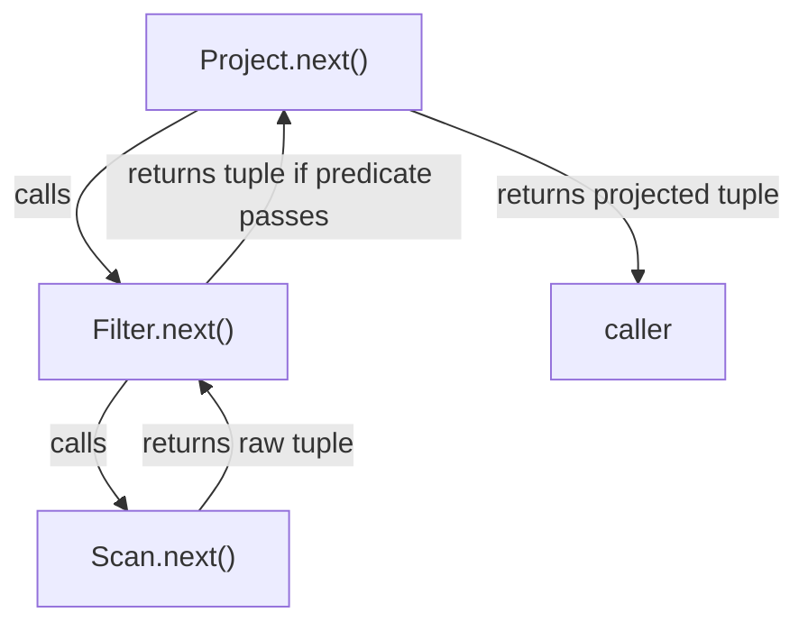

## Physical Plan Builder

### Logical to Physical Conversion

```java
PhysicalPlanBuilder builder = new PhysicalPlanBuilder(catalog);
PhysicalNode physical = builder.build(logicalPlan);
```

**Conversion rules:**

- `LogicalScan` -> `PhysicalScan`
- `LogicalFilter` -> `PhysicalFilter`
- `LogicalProject` -> `PhysicalProject`
- `LogicalJoin` -> `PhysicalHashJoin` (if equi-join) or `PhysicalNestedLoopJoin`

**Schema propagation:**

- Tracks schema through operator tree
- Needed for expression evaluation
- Ensures type safety

### Join Algorithm Selection

The algorithm is chosen per the `JoinAlgorithmPolicy` (see
[The Unified Optimizer Pipeline](#the-unified-optimizer-pipeline)). Under `COST_BASED`, an equi-join compares the
physical cost of a hash join (which scales with the *sum* of the input sizes) against a nested-loop join (which
scales with their *product*) and keeps the cheaper; `FORCE_HASH` / `FORCE_NLJ` override that choice. A non-equi join
always uses nested-loop.

```java
private PhysicalNode chooseJoinAlgorithm(LogicalJoin join, PhysicalNode left, PhysicalNode right, ...) {
    if (!isEquiJoin(join.getCondition())) {
        return new PhysicalNestedLoopJoin(...);          // hash join needs an equi-key
    }
    return switch (joinAlgorithmPolicy) {
        case FORCE_NLJ  -> new PhysicalNestedLoopJoin(...);
        case FORCE_HASH -> new PhysicalHashJoin(...);
        case COST_BASED -> costEstimator.hashJoinCost(left, right) <= costEstimator.nestedLoopJoinCost(left, right)
                ? new PhysicalHashJoin(...)
                : new PhysicalNestedLoopJoin(...);
    };
}
```

## Execution Engine

### Executor Class

```java
class Executor {
    ExecutionResult execute(PhysicalNode plan) {
        Iterator iter = (Iterator) plan;
        List<Object[]> results = new ArrayList<>();

        long start = System.currentTimeMillis();

        iter.open();
        Object[] tuple;
        while ((tuple = iter.next()) != null) {
            results.add(tuple);
        }
        iter.close();

        long time = System.currentTimeMillis() - start;

        return new ExecutionResult(results, time);
    }
}
```

### Execution Result

```java
class ExecutionResult {
    List<Object[]> tuples;        // Result data
    long executionTimeMs;          // How long it took
    long tuplesProcessed;          // Tuples examined

    int getResultCount();          // Rows returned
}
```

## Demos

### Run the **FoundationDemo** class to see the Milestone 1 features in action.

**Expected Output:**

- Creates 3 sample CSV files (customers, products, orders)
- Loads tables into catalog
- Displays metadata and statistics
- Shows hardcoded logical plan with annotations
- Demonstrates core interfaces

### Run the **ParserAndLogicalPlansDemo** class to see the Milestone 2 features in action.

**Expected Output:**
Demonstrates 5 queries:

1. Simple filter and projection
2. Multiple filters (shows canonical form)
3. Join with filter
4. Multi-way join
5. Aggregation with GROUP BY

Each query shows: original SQL, parsed AST, logical plan tree and operator analysis

#### Example Queries

#### Query 1: Simple Filter

```sql
SELECT name, price
FROM products
WHERE category = 'Electronics'
```

**Logical Plan:**

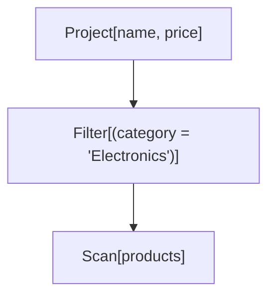

#### Query 2: Canonical Form Demo

```sql
SELECT name
FROM customers
WHERE city = 'Seattle'
  AND age > 30
```

**Logical Plan (Note: 2 separate Filter nodes):**

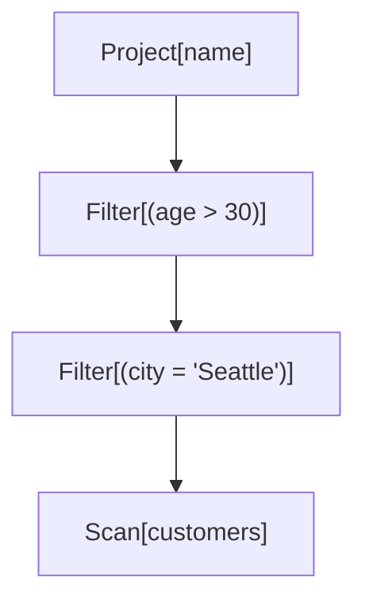

#### Query 3: Join

```sql
SELECT c.name, o.total
FROM customers c
         INNER JOIN orders o ON c.id = o.customer_id
WHERE c.city = 'Seattle'
```

**Logical Plan:**

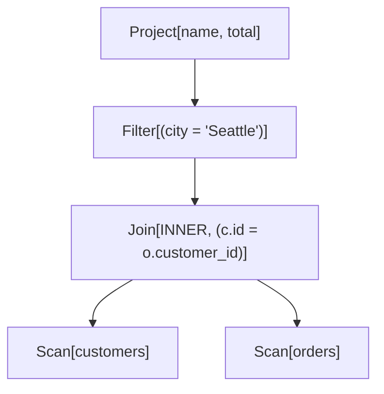

#### Query 4: Aggregation

```sql
SELECT category, COUNT(*), AVG(price)
FROM products
GROUP BY category
```

**Logical Plan:**

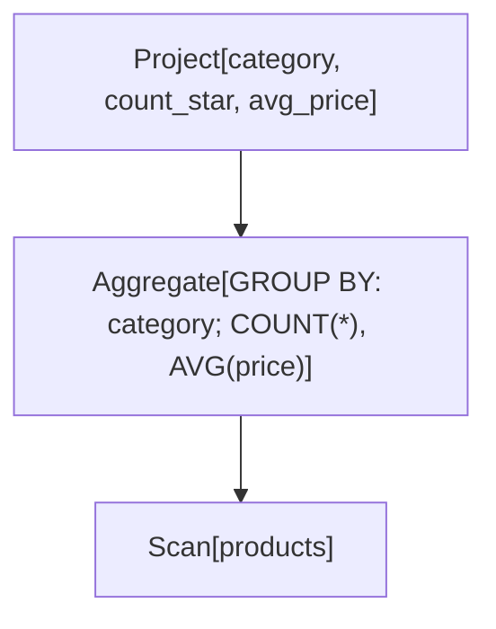

### Run the **RuleEngineAndOptimizationsDemo** class to see the Milestone 3 features in action.

**Expected Output:**
Demonstrates 3 queries:

1. Predicate pushdown with before/after comparison
2. Multiple predicate pushdown in multi-way join
3. Cost model sensitivity analysis

Each query shows:

- Initial unoptimized plan
- Optimized plan with costs
- Cost improvement percentage

#### Example: Complete Optimization

```sql
SELECT c.name, o.total
FROM customers c
         INNER JOIN orders o ON c.id = o.customer_id
WHERE c.city = 'Seattle'
  AND o.total > 100
```

**Initial Plan (Unoptimized):**

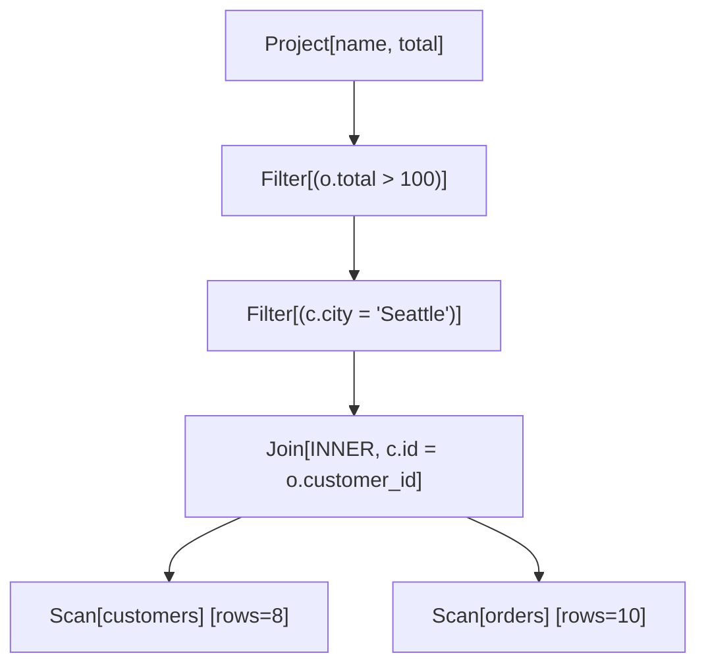

**After Optimization:**

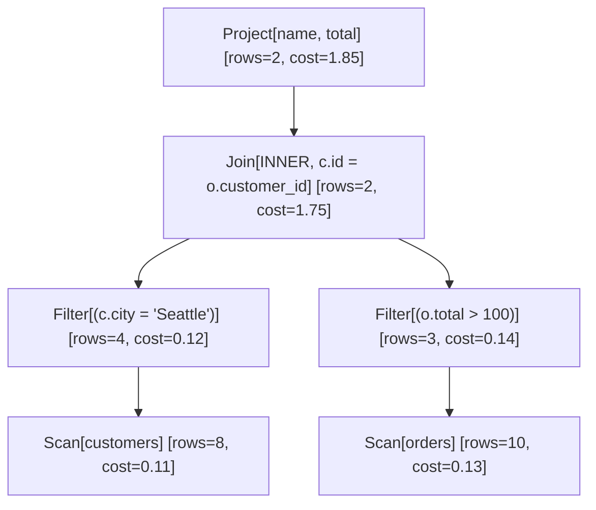

**Optimizations Applied:**

1. **Predicate Pushdown**: Both filters pushed below join
2. **Cost Reduction**: Intermediate result size reduced from 80 to 12 rows
3. **Improvement**: ~45% cost reduction

### Run **DPJoinOrderingDemo** to see the Dynamic Programming based join-ordering optimizations in action.

**Output includes:**

1. 3-table join optimization with before/after comparison
2. 4-table join optimization
3. Algorithm statistics (memo cache size)
4. Scalability analysis (2-6 tables)

### Run **HistogramDemo** to see the histogram-based optimizations in action.

**Output includes:**

1. Histogram structure visualization
2. Equality predicate estimates
3. Range predicate estimates (>, <, BETWEEN)
4. Comparison with NDV-only estimates
5. Impact on query cost

### Run **CostCalibrationDemo** to see the cost calibration optimizations in action.

**Output includes:**

1. System information (CPU, RAM, Java version)
2. Calibration progress (each benchmark)
3. Default vs calibrated cost comparison
4. Impact on query cost estimates
5. Realistic time estimates for queries
6. Save/load demonstration

### Run the **PhysicalExecutionDemo** class to see the Milestone 4 features in action.

**Output shows:**

1. Simple scan execution
2. Filter execution
3. Join execution
4. Join algorithm comparison
5. Complete pipeline (parse -> optimize -> execute)

## The Unified Optimizer Pipeline

All of the stages above — parsing, rule rewrites, join ordering, estimation, and physical planning — are tied
together by a single entry point, **`QueryOptimizer`**. Earlier milestones wired these stages together ad hoc in
each demo; `QueryOptimizer` is the one orchestration path that the demos, benchmarks, and learned optimizers all
share, so they exercise the same behavior.

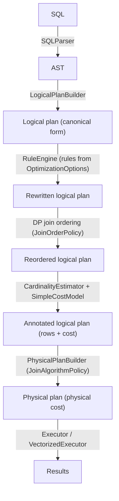

### QueryOptimizer

```java
QueryOptimizer optimizer = new QueryOptimizer(catalog);
QueryOptimizer.OptimizationResult result = optimizer.optimize(sql, OptimizationOptions.defaults());

result.initialLogicalPlan();     // as parsed (canonical form)
result.optimizedLogicalPlan();   // after rules + join reordering + annotation
result.physicalPlan();           // executable, annotated with physical cost
```

### OptimizationOptions

A single immutable object controls every knob, so the same query can be planned several ways for comparison (this
is exactly how the learned optimizers generate plan variants):

```java
new OptimizationOptions(
    enablePredicatePushdown,   // boolean
    enableProjectionPushdown,  // boolean
    enableFilterMerge,         // boolean
    joinOrderPolicy,           // PRESERVE_INPUT | DP
    joinAlgorithmPolicy,       // COST_BASED | FORCE_HASH | FORCE_NLJ
    cardinalityModelType);     // HEURISTIC | LEARNED

// A five-argument convenience constructor defaults cardinalityModelType to HEURISTIC.
OptimizationOptions.defaults(); // all rules on, DP join ordering, hash join, heuristic CE
```

| Knob | Values | Effect |
|---|---|---|
| `JoinOrderPolicy` | `PRESERVE_INPUT`, `DP` | Keep the FROM order, or search for the cheapest order via dynamic programming |
| `JoinAlgorithmPolicy` | `COST_BASED`, `FORCE_HASH`, `FORCE_NLJ` | Pick hash vs. nested-loop by physical cost, or force one |
| `CardinalityModelType` | `HEURISTIC`, `LEARNED` | Use the heuristic estimator, or a learned model (see [Learned Cardinality Estimation](#learned-cardinality-estimation)); falls back to heuristic when no model is supplied |

### DP Join Ordering on Real Plans

Dynamic-programming join ordering (the standalone algorithm from `DPJoinOrderer`) is integrated into the pipeline
for connected inner-join trees of three or more tables. The join inputs are extracted as whole single-table
*leaves* — a scan together with any operators pushed onto it, such as a filter — so reordering preserves those
operators rather than dropping them. A join subtree the extractor cannot safely reorder (e.g. a filter spanning two
tables) is left in its input order.

### Statistics-Propagating Cardinality Estimation

`CardinalityEstimator` propagates a `SubtreeStatistics` structure up the plan: alongside the estimated row count it
carries a per-column estimate of the number of distinct values (NDV) and optional min/max. This lets estimates made
higher in the tree reflect the filtering and projection done below them — a filter that pins a column to one value
drops that column's NDV to 1, and a join above it uses the *reduced* NDV instead of reaching back to the original
base-table statistics. (Estimates are keyed by unqualified column name; columns that share a name within one
subtree are a known limitation, documented in the code.)

### Learned Cardinality Estimation

Cardinality estimation is pluggable. `CardinalityModel` is the seam: `HeuristicCardinalityModel` (the default) wraps
the estimator above, while `LearnedCardinalityModel` predicts cardinality with a neural network. The optimizer
selects between them via `OptimizationOptions.cardinalityModelType` and a learned model supplied to the
`QueryOptimizer`:

```java
// Train a model from a workload (exact subplan cardinalities are the labels)
CardinalityTrainingData data = new CardinalityTrainingData(catalog);
List<CardinalityTrainingData.Example> examples = data.generate(workloadLogicalPlans);
SimpleNeuralNetwork net = CardinalityModelTrainer.train(examples, /*epochs*/ 800, /*lr*/ 0.01, /*seed*/ 21);

CardinalityModel learned = new LearnedCardinalityModel(net, data.featurizer(), new HeuristicCardinalityModel(catalog));

// Hand the learned model to the optimizer; LEARNED mode then uses it.
QueryOptimizer optimizer = new QueryOptimizer(catalog, learned);
var options = new OptimizationOptions(true, true, true,
        JoinOrderPolicy.DP, JoinAlgorithmPolicy.COST_BASED, CardinalityModelType.LEARNED);
optimizer.optimize(sql, options);
```

How it works:

- **Featurization** — `CardinalityFeaturizer` turns a logical subplan into a 12-element vector: base-table sizes,
  predicate kinds, join/aggregate counts, and — crucially — the *heuristic estimate itself*. Feeding the heuristic
  in as a feature lets the network learn a **correction** on a sensible baseline, which is what makes it data-efficient
  on small synthetic workloads.
- **Targets in log space** — cardinalities span orders of magnitude, so the network regresses `log(cardinality)` with
  MSE; `estimate()` exponentiates the prediction back to a row count.
- **Training data** — `CardinalityTrainingData` executes every supported subplan of each workload query to obtain its
  *exact* output cardinality as the label, yielding many examples per query.
- **Evaluation** — `QErrorStats` reports the standard scale-free q-error (`max(pred/actual, actual/pred)`); held-out
  tests confirm the trained model generalizes to unseen queries and stays competitive with the heuristic.
- **Fallback everywhere** — the learned model defers to the heuristic for unsupported plan shapes, a missing/untrained
  network, or a non-finite prediction; and the optimizer defers to the heuristic when `LEARNED` is requested but no
  model was supplied. A misbehaving or absent model therefore degrades gracefully rather than failing.

### Logical vs. Physical Costing

Two cost concerns are kept separate:

- **`SimpleCostModel`** costs *logical* plans and drives join ordering (how many rows each operator produces).
- **`PhysicalCostEstimator`** costs the chosen *physical* operators (hash join cost scales with the sum of input
  sizes, nested-loop with their product), and is what cost-based join-algorithm selection compares. The physical
  plan's cost annotations come from this estimator, so the same query's hash and nested-loop variants get
  distinguishable costs.

### Trying It Out

`TraditionalOptimizerDemo` runs one three-way join through the entire pipeline, prints each stage, and contrasts the
strong configuration (all rules, DP ordering, cost-based join selection) against a naive baseline (no rules, input
order, forced nested-loop): lower estimated cost, identical results.

```bash
mvn -q compile exec:java -Dexec.mainClass=org.query.optimizer.TraditionalOptimizerDemo
```

## Vectorized Execution

### Overview

Alongside the Volcano iterator model, the optimizer includes a second execution engine that processes data in
batches rather than one tuple at a time. The two engines accept the same optimized logical plan and produce the
same `ExecutionResult`, making it straightforward to compare their outputs.

**Why vectorized execution?**

The Volcano model calls `next()` once per tuple. Each call crosses operator boundaries, which adds up to millions
of virtual dispatch events for large tables. Vectorized execution amortizes that overhead by returning a batch of
up to 1024 rows per `next()` call. Fewer calls means less interpreter overhead and, more importantly, tighter
inner loops that the JIT can autovectorize over typed primitive arrays.

### Columnar Storage

#### ColumnVector

The fundamental storage unit. Instead of boxing values into `Object[]`, each column is stored as a typed
primitive array chosen at construction time:

| Data type | Backing array |
|-----------|---------------|
| INTEGER   | `int[]`       |
| FLOAT     | `float[]`     |
| VARCHAR   | `String[]`    |

Null tracking uses a separate `boolean[]` so it stays off the hot path when iterating non-null columns.
Typed getters (`getInt`, `getFloat`, `getString`) avoid boxing entirely on the read path.

```java
ColumnVector v = ColumnVector.create(DataType.INTEGER, 1024);
v.putInt(0, 42);
int val = v.getInt(0);   // no boxing, direct array access
```

#### ColumnBatch

A horizontal slice of a table: one `ColumnVector` per schema column, all sharing the same logical row count.
This is the unit exchanged between operators -- analogous to the single `Object[]` in the Volcano model, but
carrying up to `DEFAULT_BATCH_SIZE` (1024) rows per call.

```java
// DEFAULT_BATCH_SIZE = 1024 -- same as CockroachDB, DuckDB, and Velox
ColumnBatch batch = new ColumnBatch(schema);
batch.setSize(rowCount);
ColumnVector priceCol = batch.getVector("price");
```

**Selection vectors.** Rather than physically removing non-qualifying rows after a filter, a batch carries an
optional `int[]` selection vector listing the indices of live rows. Downstream operators iterate only those
indices:

```java
int[]  sv   = batch.getSelectionVector();
int    size = batch.getSelectionSize();
for (int i = 0; i < size; i++) {
    int row = sv[i];
    // read batch.getVector(col).getInt(row)
}
```

This avoids all data movement. The column arrays are never compacted; the branch predictor handles the tight
loop cleanly.

#### ColumnarTable

The existing `TableMetadata` stores rows in row-major form. `ColumnarTable` performs a one-time pivot to
column-major layout on first access, then caches the result in the catalog.

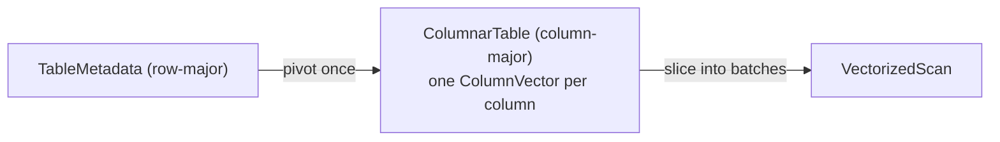

A filter on `price` only needs to load `price`'s `float[]` into cache. In row-oriented storage, every cache
line also pulls in `id`, `name`, and every other column the filter ignores.

---

### VectorizedOperator Interface

The vectorized counterpart of the Volcano `Iterator`. The lifecycle is identical -- `open / next / close` --
but `next()` returns a `ColumnBatch` instead of a single tuple.

```java
VectorizedOperator plan = new VectorizedPlanBuilder(catalog).build(logicalPlan);
plan.open();
ColumnBatch batch;
while ((batch = plan.next()) != null) {
    // process up to 1024 rows per iteration
}
plan.close();
```

Operators reuse the same `ColumnBatch` instance across `next()` calls (allocated once in `open()`). Callers
that need to retain a batch past the next call must copy the relevant data out first.

---

### Operators

#### VectorizedScan

Reads a `ColumnarTable` and emits one batch per `next()` call by slicing each column vector into the output
batch using `System.arraycopy`. No selection vector is set -- all rows in the batch are live.

#### VectorizedFilter

Evaluates a predicate over an entire batch using `VectorizedExpressionEvaluator.evaluateFilter`, which
populates a selection vector rather than copying qualifying rows. The filter never moves data; it only marks
which rows survive.

Stacking two `VectorizedFilter` nodes is equivalent to a single AND predicate with no extra work:
`evaluateFilter` automatically intersects with any existing selection vector on the incoming batch.

When every row in a batch is eliminated, the operator silently fetches the next batch from its input rather
than surfacing an empty batch to the caller.

#### VectorizedHashJoin

A two-phase inner equi-join (single join column):

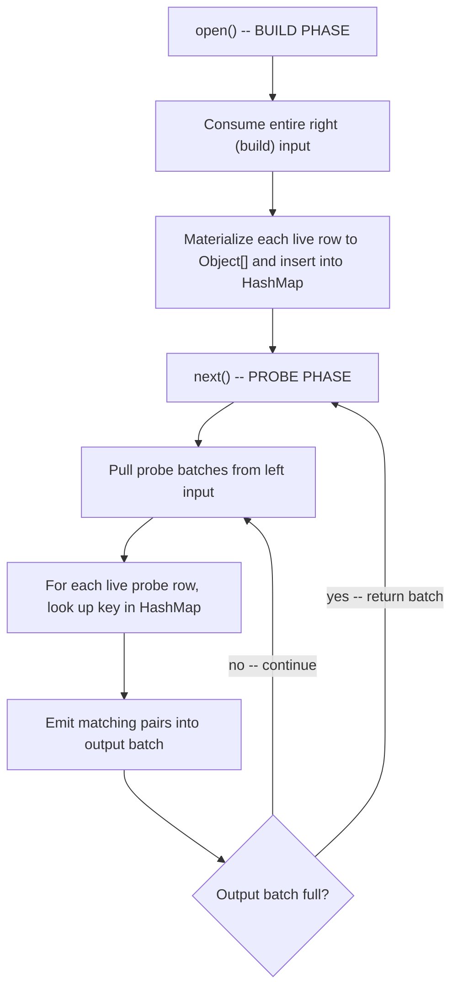

The build phase runs entirely inside `open()`, making the probe phase a pure streaming loop. A state machine
preserves position across `next()` calls so a match stream that spans more than one output batch is handled
correctly.

#### VectorizedAggregate

A blocking operator with two clearly separated phases:

1. **Accumulation** -- the first `next()` call drains all input batches. For each live row, the group key is
   extracted as a `List<Object>` and used to look up (or create) an `AggregateAccumulator` array in a
   `LinkedHashMap`. Each accumulator (`CountAccumulator`, `SumAccumulator`, etc.) is updated in-place.
   Selection vectors on input batches are fully respected.

2. **Emission** -- subsequent `next()` calls iterate the group map and write results into output batches of
   up to 1024 rows. A `LinkedHashMap` preserves insertion order for deterministic output.

Supported aggregate functions: `COUNT`, `SUM`, `AVG`, `MIN`, `MAX`. Output type inference:

| Function        | Output type                    |
|-----------------|--------------------------------|
| `COUNT`         | INTEGER                        |
| `AVG`           | FLOAT                          |
| `SUM/MIN/MAX`   | Same as input column type      |

#### VectorizedProject

Selects a subset of columns from each input batch by swapping `ColumnVector` references in the output batch,
not by copying data. The selection vector from the input batch (if any) is preserved unchanged.

---

### VectorizedPlanBuilder

Converts the same `LogicalNode` tree used by `PhysicalPlanBuilder` into a tree of `VectorizedOperator`s.
Both builders accept the same input, which makes side-by-side comparison straightforward:

```java
LogicalNode logicalPlan = new LogicalPlanBuilder(catalog).build(ast);
logicalPlan = ruleEngine.optimize(logicalPlan);

// Volcano path
PhysicalNode    volcanoPlan  = new PhysicalPlanBuilder(catalog).build(logicalPlan);
ExecutionResult volcanoResult = new Executor().execute(volcanoPlan);

// Vectorized path
VectorizedOperator vecPlan   = new VectorizedPlanBuilder(catalog).build(logicalPlan);
ExecutionResult    vecResult  = new VectorizedExecutor().execute(vecPlan);

// Same result type -- directly comparable
assertEquals(volcanoResult.tuples(), vecResult.tuples());
```

Supported conversions:

| Logical operator   | Vectorized operator      |
|--------------------|--------------------------|
| `LogicalScan`      | `VectorizedScan`         |
| `LogicalFilter`    | `VectorizedFilter`       |
| `LogicalProject`   | `VectorizedProject`      |
| `LogicalJoin`      | `VectorizedHashJoin`     |
| `LogicalAggregate` | `VectorizedAggregate`    |

### VectorizedExecutor

Drives the operator tree and materializes results into the same `ExecutionResult` used by the Volcano
`Executor`. When a batch carries a selection vector, only the selected rows are emitted.

```java
VectorizedExecutor exec = new VectorizedExecutor();
ExecutionResult result = exec.execute(plan);

// Or print a formatted result table to stdout
exec.executeAndPrint(plan);
```

---

## AI-Powered Plan Selection

The optimizer includes two learned plan selection strategies that sit on top of the
existing optimizer pipeline rather than replacing it. Both generate alternative physical
plans for a query (using different "hint sets"), featurize them into numeric vectors,
and use a trained model to pick the best one.

### Shared Infrastructure

#### HintSet

An immutable configuration that controls which optimization rules are applied, whether
the physical plan builder prefers hash or nested-loop joins, and the join-order policy.

```java
// Six predefined hint sets (the "arms" in Bao's bandit terminology)
HintSet.DEFAULT           // all rules, hash join, DP join ordering
HintSet.FORCE_NLJ         // all rules, nested-loop join forced
HintSet.NO_PUSHDOWN       // skip predicate/projection pushdown
HintSet.NO_PUSHDOWN_NLJ   // skip pushdown, force NLJ
HintSet.MINIMAL_OPT       // no optimization rules at all
HintSet.PRESERVE_ORDER    // all rules, hash join, but keep the input join order (no DP)

List<HintSet> arms = HintSet.allHintSets(); // all six
```

Join order is a bandit dimension alongside the rule and join-algorithm knobs: `PRESERVE_ORDER` lets the model learn
when keeping the written (FROM) order beats the cost-based DP order. `OptimizationOptions.fromHintSet` maps a hint
set's knobs — including its `JoinOrderPolicy` — onto the optimizer.

#### PlanVariantGenerator

Generates one physical plan per hint set for a given logical plan, deduplicating
structurally identical plans before returning.

```java
PlanVariantGenerator gen = new PlanVariantGenerator(catalog, costModel);
Map<HintSet, PhysicalNode> variants = gen.generateVariants(logicalPlan, HintSet.allHintSets());
// A join query typically yields 2-4 distinct physical plans
```

#### PlanFeaturizer

Converts a physical plan tree into a fixed-length `double[]` suitable for neural
network input. Uses BFS traversal across up to 8 operator slots (6 features each) plus
4 global features (depth, total cost, total rows, operator count) — 52 elements in all.
Operator types include scan, filter, project, hash/nested-loop join, **and aggregate**;
the eight slots cover deeper plans such as a three-way join with pushed-down filters and
an aggregate.

```java
double[] features = new PlanFeaturizer().featurize(physicalNode);
// features.length == PlanFeaturizer.FEATURE_DIM (52)
```

The Bao and Lero network input sizes derive from `PlanFeaturizer.FEATURE_DIM`, so they
resize automatically if the featurization changes.

#### WorkloadGenerator / DataGenerator

`WorkloadGenerator` generates random SQL queries across five shapes (simple scan,
filtered scan, 2-way join, 3-way join, join + aggregation). `DataGenerator` populates
a catalog with synthetic `customers`, `orders`, and `products` tables at configurable
scale.

```java
DataGenerator.generate(catalog, 10);   // ~10K rows per table
WorkloadGenerator wl = new WorkloadGenerator(catalog);
List<ParsedQuery> queries = wl.generateWorkload(200);
```

---

### Hand-Rolled Neural Network

A minimal feedforward MLP with backpropagation, used by both Bao and Lero.

#### SimpleNeuralNetwork

Configurable layer sizes, Xavier uniform weight initialization, ReLU hidden layers,
linear output, and online SGD. Supports save/load to plain-text files.

```java
// Bao's value network, for example, is FEATURE_DIM (52) -> 64 -> 32 -> 1
SimpleNeuralNetwork net = new SimpleNeuralNetwork(new int[]{PlanFeaturizer.FEATURE_DIM, 64, 32, 1}, 0.001);

// Train on (features, target) pairs
net.trainStep(planFeatures, new double[]{observedLatency}, LossFunction.mse());

// Predict
double predicted = net.predict(planFeatures)[0];

// Save / load
net.save("model.txt");
SimpleNeuralNetwork loaded = SimpleNeuralNetwork.load("model.txt");
```

#### LossFunction / ActivationFunction

`LossFunction` provides `mse()` (for latency regression) and `bce()` (for pairwise
classification). `ActivationFunction` provides `relu`, `reluDerivative`, `sigmoid`,
and `sigmoidDerivative` as static methods.

---

### Bao: Bandit-Based Plan Steering

Bao treats each hint set as a bandit "arm" and uses Thompson Sampling over an
ensemble of neural networks to select the arm expected to produce the fastest plan.
After executing the chosen plan, the observed latency is fed back to improve the model.

#### PlanValueModel

An ensemble of three neural networks that predicts both mean and variance of latency
for a plan. Retrains periodically on a growing replay buffer, with each ensemble
member trained on a different bootstrap sample.

```java
PlanValueModel model = new PlanValueModel(new Random(42));

// Add observed execution feedback
model.addFeedback(new ExecutionFeedback(sql, hintSet, features, latencyMs, tuples, ...));

// Predict latency with uncertainty
PredictionWithUncertainty p = model.predict(planFeatures);
// p.mean() and p.variance()
```

#### ThompsonSampler

Draws from the `N(mean, variance)` posterior for each plan and returns the arm
with the lowest sampled predicted latency.

#### BanditOptimizer

Orchestrates the full Bao loop: generate variants -> featurize -> Thompson sample ->
execute -> record feedback.

```java
BanditOptimizer bao = new BanditOptimizer(catalog);
ExecutionResult result = bao.optimizeAndExecute(logicalPlan);

// Run an entire workload and collect per-query metrics
List<BanditOptimizer.QueryMetrics> metrics = bao.runWorkload(workload);
```

#### BaoDemo

Runs a 200-query demo showing the learning curve (cumulative latency over time),
arm selection histogram, per-query latency breakdown, and Bao vs. default comparison.

---

### Lero: Learning-to-Rank Plan Selection

Lero avoids predicting absolute latency. Instead, it trains a pairwise comparator
that learns to say "plan A is faster than plan B" -- a strictly easier learning task.

#### PairwiseComparator

A Siamese neural network: both plans are encoded by the same shared encoder
(`FEATURE_DIM -> 64 -> 32`), the resulting embeddings are concatenated with their difference
(`96`-dim), and a classifier (`96 -> 32 -> 1`) outputs P(plan A is faster than plan B).

```java
PairwiseComparator comparator = new PairwiseComparator();

// Train on a labeled pair
double loss = comparator.trainStep(featuresA, featuresB, /* aIsFaster= */ true);

// Compare two plans
double prob = comparator.compare(featuresA, featuresB);  // > 0.5 -> A predicted faster

// Pick the best plan from a set via round-robin tournament
int bestIdx = comparator.tournamentSelect(List.of(feat0, feat1, feat2, feat3));

// Evaluate on held-out pairs
double accuracy = comparator.evaluateAccuracy(testPairs);
```

#### PlanExplorer

Generates training data by executing all plan variants for a query and recording
every pairwise comparison. Produces both directions of each pair for balanced training.

#### LeroOptimizer

During a warm-up period it uses the cost model and runs the `PlanExplorer` to
accumulate training pairs. Once warm-up is complete, it uses `tournamentSelect`
for plan selection and re-explores on 10% of queries for continued learning.

```java
LeroOptimizer lero = new LeroOptimizer(catalog);
ExecutionResult result = lero.optimizeAndExecute(logicalPlan);

// Run a full workload
List<LeroOptimizer.QueryMetrics> metrics = lero.runWorkload(workload);
// QueryMetrics includes: result, selectedPlan, usedCostModel flag
```

#### LeroDemo

Runs a 200-query demo with five output sections: overall summary, learning curve at
query checkpoints, pairwise comparator accuracy over time, Lero vs. cost-model
disagreement analysis, and warm-up vs. warm-phase statistics.

---

### Comparison Benchmark

#### LearnedOptimizerBenchmark

Runs the same workload through all four strategies -- DEFAULT, ORACLE, BAO, and LERO --
and produces both per-query and aggregate metrics. The ORACLE strategy executes every
distinct plan variant and keeps the cheapest one, giving the theoretical performance
ceiling no strategy can beat.

Metrics computed per strategy:

| Metric | Description |
|---|---|
| Total latency | Sum of all per-query execution times |
| Regret vs. oracle | `total / oracleTotal`; 1.0 = perfect |
| Learning speed | First query at which rolling avg <= 1.2x oracle rolling avg |
| P95 / P99 tail latency | 95th and 99th percentile per-query latency |

Cross-strategy metric: **Bao-Lero agreement rate** -- fraction of queries where both
strategies chose a plan with the same estimated cost. Used as a proxy for structural
plan identity (see Javadoc for full rationale).

```java
LearnedOptimizerBenchmark bench = new LearnedOptimizerBenchmark(catalog);
BenchmarkResults results = bench.run(workload);

results.defaultTotal();                         // total ms for DEFAULT
results.oracleTotal();                          // total ms for ORACLE (ceiling)
results.baoTotal();                             // total ms for BAO
results.leroTotal();                            // total ms for LERO
results.baoLeroAgreementRate();                 // 0.0-1.0
results.baoMetrics().regretVsOracle();          // e.g. 1.15 = 15% above oracle
results.leroMetrics().learningSpeedQuery();     // query index where Lero converged
```

#### BaoVsLeroDemo

The showpiece combined demo. Generates a 300-query workload, runs all four strategies
through `LearnedOptimizerBenchmark`, and prints a seven-section report:

1. **Overview** -- one-row summary per strategy (total ms, regret ratio, P95/P99, convergence query)
2. **Learning curves** -- cumulative latency at queries 50/100/150/200/250/300 for all four strategies
3. **Bao deep-dive** -- arm selection counts split into early/mid/late thirds; arm diversity per
   period as a proxy for the exploration to exploitation transition
4. **Lero deep-dive** -- pairwise comparator accuracy at queries 50/100/200/300 (trained
   incrementally), plus warm-up vs. warm-phase latency breakdown
5. **Head-to-head** -- per-query win/loss between Bao and Lero, agreement rate, and shared failure
   modes (queries where both strategies underperformed the default)
6. **Cost-based join-algorithm mix** -- how the cost model distributes hash vs. nested-loop joins
   across the workload
7. **Wall-clock distribution** -- each strategy's total latency as a median and IQR over a handful of
   timed repeats (after a warm-up pass). Sections 1-6 are seeded and reproduce identically on any
   machine; this is the only machine-dependent section, so it is reported as a distribution rather
   than a single noisy total

```bash
mvn -q exec:java -Dexec.mainClass=org.query.optimizer.learned.benchmark.BaoVsLeroDemo
```

---

## Run Tests

These runs automatically when you build with Maven without skipping tests,

- FoundationTest contains end-to-end tests for Milestone 1 features
- ParsingAndLogicalPlansTest contains end-to-end tests for Milestone 2 features
- RuleEngineAndOptimizationsTest contains end-to-end tests for Milestone 3 features
- LearnedOptimizerTest contains end-to-end tests for the AI plan selection features
  (featurization, MLP training, Bao/Lero correctness, and benchmark invariants)
- The `learned/cardinality` test package covers the learned cardinality estimator: training-data
  labelling, training reducing q-error, optimizer mode selection/fallback, and held-out generalization
- TraditionalOptimizerPipelineTest exercises the full traditional pipeline (rules → DP join ordering →
  cost-based physical planning → execution) against a naive baseline

## File Reference

| File                                                                     | Purpose                                              |
|--------------------------------------------------------------------------|------------------------------------------------------|
| `org/query/optimizer/catalog/DataType.java`                              | Supported data types (INTEGER, FLOAT, VARCHAR)       |
| `org/query/optimizer/catalog/Schema.java`                                | Table schema with column definitions                 |
| `org/query/optimizer/catalog/ColumnStats.java`                           | Simple column statistics (NDV, min/max, nulls)       |
| `org/query/optimizer/catalog/TableMetadata.java`                         | Table metadata including schema, stats, and data     |
| `org/query/optimizer/catalog/Catalog.java`                               | Central metadata registry with CSV loading           |
| `org/query/optimizer/logical/LogicalNode.java`                           | Base class for logical plan nodes                    |
| `org/query/optimizer/logical/Expression.java`                            | Expression trees (columns, literals, binary ops)     |
| `org/query/optimizer/physical/PhysicalNode.java`                         | Base class for physical plan nodes                   |
| `org/query/optimizer/Rule.java`                                          | Interface for optimization rules                     |
| `org/query/optimizer/catalog/CostModel.java`                            | Interface for cost estimation with config            |
| `org/query/optimizer/executor/Iterator.java`                             | Volcano-model execution interface                    |
| `org/query/optimizer/FoundationDemo.java`                                | Demonstrates all Milestone 1 features                |
| `org/query/optimizer/FoundationTest.java`                                | End-to-end tests for Milestone 1                     |
| `org/query/optimizer/parser/AST.java`                                    | Complete AST node hierarchy                          |
| `org/query/optimizer/parser/SQLParser.java`                              | Hand-written SQL parser                              |
| `org/query/optimizer/parser/LogicalPlanBuilder.java`                     | AST to logical plan visitor                          |
| `org/query/optimizer/logical/LogicalScan.java`                           | Table scan operator                                  |
| `org/query/optimizer/logical/LogicalFilter.java`                         | Filter/selection operator                            |
| `org/query/optimizer/logical/LogicalProject.java`                        | Projection operator                                  |
| `org/query/optimizer/logical/LogicalJoin.java`                           | Join operator                                        |
| `org/query/optimizer/logical/LogicalAggregate.java`                      | Aggregation operator                                 |
| `org/query/optimizer/ParsingAndLogicalPlansDemo.java`                    | Demonstrates all Milestone 2 features                |
| `org/query/optimizer/ParsingAndLogicalPlansTest.java`                    | End-to-end tests for Milestone 2                     |
| `org/query/optimizer/RuleEngine.java`                                    | Fixpoint iteration engine                            |
| `org/query/optimizer/rules/PredicatePushdown.java`                       | Push filters below joins                             |
| `org/query/optimizer/rules/ProjectionPushdown.java`                      | Push projections below filters                       |
| `org/query/optimizer/rules/FilterMerge.java`                             | Merge consecutive filters                            |
| `org/query/optimizer/SimpleCostModel.java`                               | Logical cost estimation (uses a CardinalityModel)    |
| `org/query/optimizer/CardinalityEstimator.java`                          | Heuristic cardinality + per-column NDV propagation   |
| `org/query/optimizer/SubtreeStatistics.java`                             | Derived subtree stats (rows + per-column NDV/min/max)|
| `org/query/optimizer/CardinalityModel.java`                              | Swappable cardinality-estimation interface           |
| `org/query/optimizer/HeuristicCardinalityModel.java`                     | Default CardinalityModel (wraps CardinalityEstimator)|
| `org/query/optimizer/CardinalityModelType.java`                          | HEURISTIC vs LEARNED selector for OptimizationOptions |
| `org/query/optimizer/PhysicalCostEstimator.java`                         | Physical, algorithm-aware operator costing           |
| `org/query/optimizer/QueryOptimizer.java`                                | Unified parse→rewrite→reorder→annotate→physical flow |
| `org/query/optimizer/OptimizationOptions.java`                           | Optimizer configuration (rules + join policies)      |
| `org/query/optimizer/JoinOrderPolicy.java`                               | PRESERVE_INPUT vs DP join ordering                   |
| `org/query/optimizer/JoinAlgorithmPolicy.java`                           | COST_BASED / FORCE_HASH / FORCE_NLJ                  |
| `org/query/optimizer/DPJoinOrderer.java`                                 | Dynamic-programming join ordering                    |
| `org/query/optimizer/JoinExtractor.java`                                 | Extracts reorderable join leaves + conditions        |
| `org/query/optimizer/TraditionalOptimizerDemo.java`                      | Full traditional-pipeline showcase (strong vs naive) |
| `org/query/optimizer/RuleEngineAndOptimizationsDemo.java`                | Demonstrates all Milestone 3 features                |
| `org/query/optimizer/RuleEngineAndOptimizationsTest.java`                | End-to-end tests for Milestone 3                     |
| `org/query/optimizer/physical/PhysicalScan.java`                         | Table scan operator                                  |
| `org/query/optimizer/physical/PhysicalFilter.java`                       | Filter operator                                      |
| `org/query/optimizer/physical/PhysicalProject.java`                      | Project operator                                     |
| `org/query/optimizer/physical/PhysicalNestedLoopJoin.java`               | Nested loop join                                     |
| `org/query/optimizer/physical/PhysicalHashJoin.java`                     | Hash join                                            |
| `org/query/optimizer/physical/PhysicalAggregate.java`                    | Blocking GROUP BY / aggregation (Volcano)            |
| `org/query/optimizer/physical/JoinAlgorithmCounts.java`                  | Tally of hash vs nested-loop joins in a plan         |
| `org/query/optimizer/physical/PhysicalPlanBuilder.java`                  | Logical→physical conversion (cost-based join policy) |
| `org/query/optimizer/executor/Executor.java`                             | Execution engine                                     |
| `org/query/optimizer/PhysicalExecutionDemo.java`                         | Complete demonstrations                              |
| `org/query/optimizer/PhysicalExecutionTest.java`                         | Automated tests                                      |
| `org/query/optimizer/vectorized/ColumnVector.java`                       | Typed columnar storage for a single column           |
| `org/query/optimizer/vectorized/ColumnBatch.java`                        | Batch of rows in columnar form with selection vector |
| `org/query/optimizer/vectorized/ColumnarTable.java`                      | Row-to-column pivot of TableMetadata (cached)        |
| `org/query/optimizer/vectorized/VectorizedOperator.java`                 | Batch-at-a-time operator interface (open/next/close) |
| `org/query/optimizer/vectorized/VectorizedExpressionEvaluator.java`      | Predicate evaluation over a batch; builds sel-vector |
| `org/query/optimizer/vectorized/VectorizedScan.java`                     | Scans a ColumnarTable and emits batches              |
| `org/query/optimizer/vectorized/VectorizedFilter.java`                   | Filter via selection vector, no data movement        |
| `org/query/optimizer/vectorized/VectorizedProject.java`                  | Column selection by swapping vector references       |
| `org/query/optimizer/vectorized/VectorizedHashJoin.java`                 | Two-phase hash join (build + probe)                  |
| `org/query/optimizer/vectorized/AggregateAccumulator.java`               | Per-group accumulators for COUNT/SUM/AVG/MIN/MAX     |
| `org/query/optimizer/vectorized/VectorizedAggregate.java`                | Blocking aggregation with accumulate/emit phases     |
| `org/query/optimizer/vectorized/VectorizedPlanBuilder.java`              | Logical plan to vectorized operator tree             |
| `org/query/optimizer/vectorized/VectorizedExecutor.java`                 | Drives vectorized tree; returns ExecutionResult      |
| `org/query/optimizer/learned/common/HintSet.java`                        | Immutable optimizer configuration with 6 presets     |
| `org/query/optimizer/learned/common/PlanVariantGenerator.java`           | Generate + deduplicate physical plan variants        |
| `org/query/optimizer/learned/common/PlanFeaturizer.java`                 | Convert plan tree to 52-dim feature vector           |
| `org/query/optimizer/learned/common/ExecutionFeedback.java`              | Training signal record with logicalCost()            |
| `org/query/optimizer/learned/common/WorkloadGenerator.java`              | Random SQL workload generator (5 query shapes)       |
| `org/query/optimizer/learned/common/DataGenerator.java`                  | Synthetic table generator (customers/orders/products)|
| `org/query/optimizer/learned/cardinality/CardinalityFeaturizer.java`     | Logical subplan → CE feature vector (incl. heuristic)|
| `org/query/optimizer/learned/cardinality/LearnedCardinalityModel.java`   | NN log-cardinality model with heuristic fallback     |
| `org/query/optimizer/learned/cardinality/CardinalityTrainingData.java`   | Labels subplans with exact executed cardinalities    |
| `org/query/optimizer/learned/cardinality/CardinalityModelTrainer.java`   | Trains the CE network (log-card regression)          |
| `org/query/optimizer/learned/cardinality/QErrorStats.java`               | Q-error metric + aggregate evaluation harness        |
| `org/query/optimizer/learned/nn/ActivationFunction.java`                 | ReLU and sigmoid with derivatives                    |
| `org/query/optimizer/learned/nn/LossFunction.java`                       | MSE and BCE loss functions                           |
| `org/query/optimizer/learned/nn/SimpleNeuralNetwork.java`                | Feedforward MLP with online SGD and save/load        |
| `org/query/optimizer/learned/bao/PlanValueModel.java`                    | Ensemble latency predictor with uncertainty          |
| `org/query/optimizer/learned/bao/ThompsonSampler.java`                   | Thompson Sampling over plan ensemble                 |
| `org/query/optimizer/learned/bao/BanditOptimizer.java`                   | Bao end-to-end optimizer loop                        |
| `org/query/optimizer/learned/bao/BaoDemo.java`                           | Bao demonstration with learning curve output         |
| `org/query/optimizer/learned/lero/PairwiseComparator.java`               | Siamese network for plan ranking                     |
| `org/query/optimizer/learned/lero/PlanExplorer.java`                     | Execute all variants and generate training pairs     |
| `org/query/optimizer/learned/lero/LeroOptimizer.java`                    | Lero end-to-end optimizer with warm-up/warm phases   |
| `org/query/optimizer/learned/lero/LeroDemo.java`                         | Lero demonstration with accuracy and ranking output  |
| `org/query/optimizer/learned/benchmark/LearnedOptimizerBenchmark.java`   | Four-strategy harness (DEFAULT/ORACLE/BAO/LERO)      |
| `org/query/optimizer/learned/benchmark/BaoVsLeroDemo.java`               | Five-section head-to-head comparative report         |
| `org/query/optimizer/LearnedOptimizerTest.java`                          | Tests for all AI plan selection components (Phase 1-5)|
