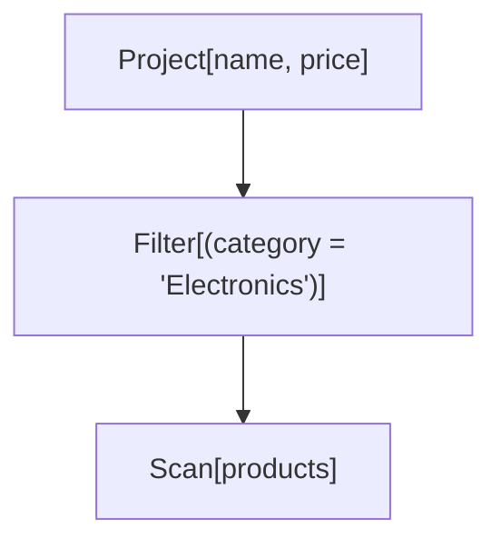
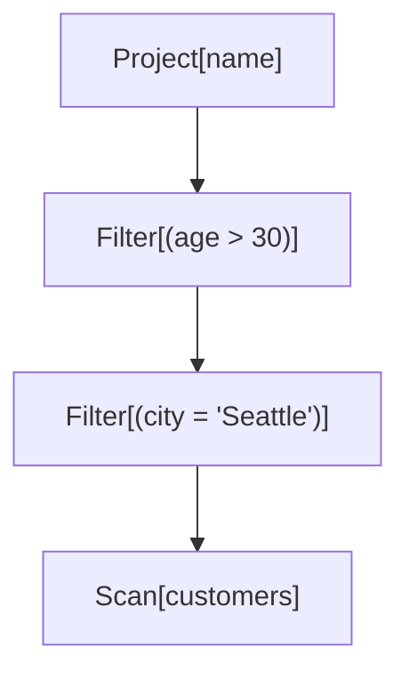
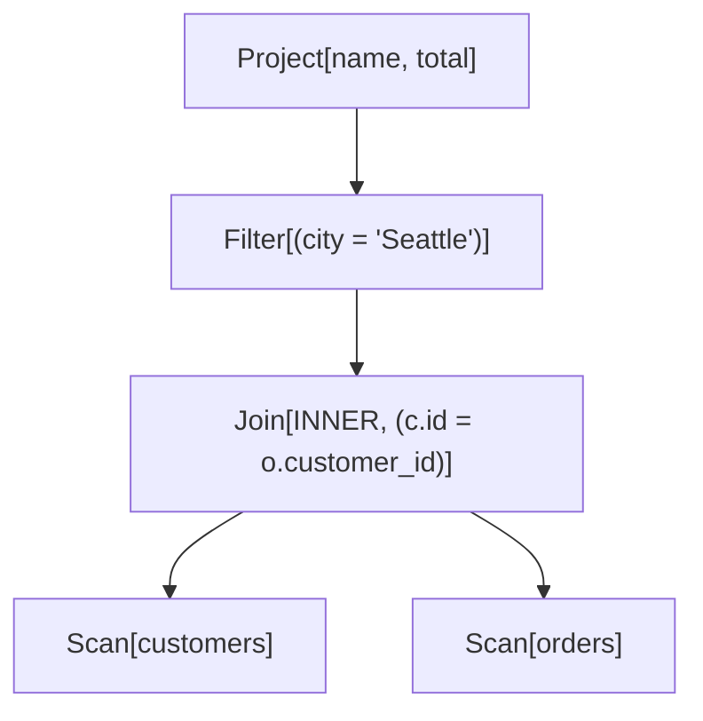
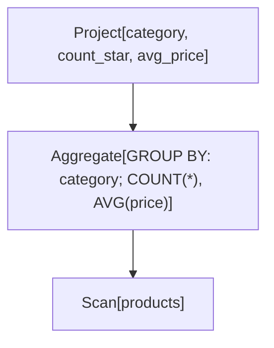
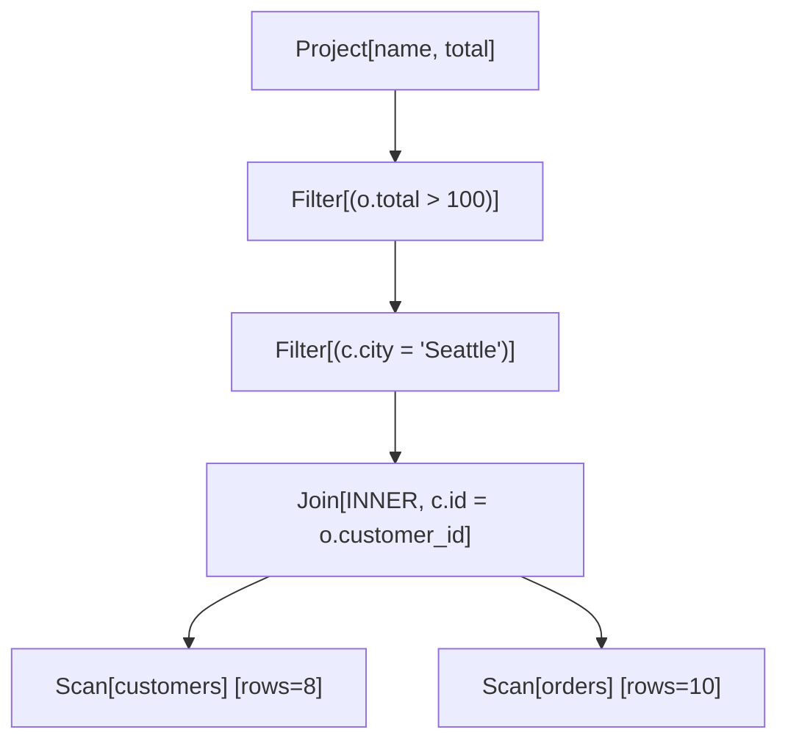
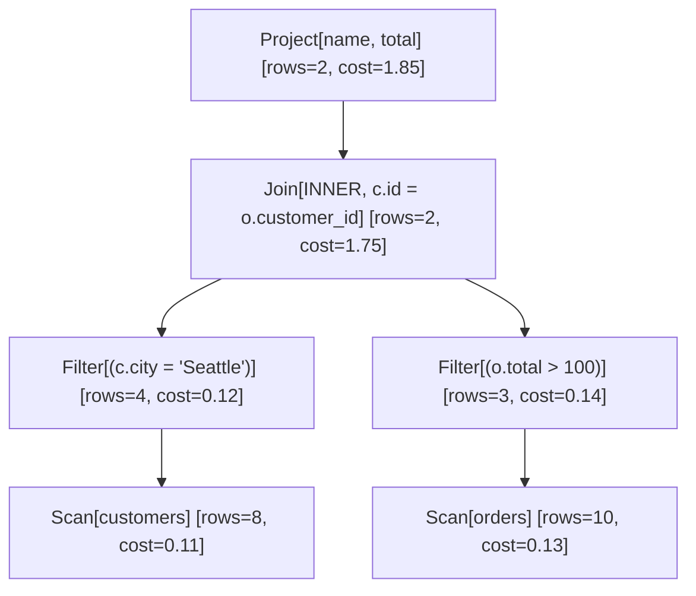

# Demos

Runnable demonstrations of each stage of the optimizer. Most create small synthetic CSV tables, run a query or
workload, and print the result to stdout. See the [README](../README.md) for the high-level tour.

### Run the **FoundationDemo** class to see the Milestone 1 features in action.

**Expected Output:**

- Creates 3 sample CSV files (customers, products, orders)
- Loads tables into catalog
- Displays metadata and statistics
- Shows hardcoded logical plan with annotations
- Demonstrates core interfaces

### Run the **ParserAndLogicalPlansDemo** class to see the Milestone 2 features in action.

**Expected Output:**
Demonstrates 5 queries:

1. Simple filter and projection
2. Multiple filters (shows canonical form)
3. Join with filter
4. Multi-way join
5. Aggregation with GROUP BY

Each query shows: original SQL, parsed AST, logical plan tree and operator analysis

#### Example Queries

#### Query 1: Simple Filter

```sql
SELECT name, price
FROM products
WHERE category = 'Electronics'
```

**Logical Plan:**



#### Query 2: Canonical Form Demo

```sql
SELECT name
FROM customers
WHERE city = 'Seattle'
  AND age > 30
```

**Logical Plan (Note: 2 separate Filter nodes):**



#### Query 3: Join

```sql
SELECT c.name, o.total
FROM customers c
         INNER JOIN orders o ON c.id = o.customer_id
WHERE c.city = 'Seattle'
```

**Logical Plan:**



#### Query 4: Aggregation

```sql
SELECT category, COUNT(*), AVG(price)
FROM products
GROUP BY category
```

**Logical Plan:**



### Run the **RuleEngineAndOptimizationsDemo** class to see the Milestone 3 features in action.

**Expected Output:**
Demonstrates 3 queries:

1. Predicate pushdown with before/after comparison
2. Multiple predicate pushdown in multi-way join
3. Cost model sensitivity analysis

Each query shows:

- Initial unoptimized plan
- Optimized plan with costs
- Cost improvement percentage

#### Example: Complete Optimization

```sql
SELECT c.name, o.total
FROM customers c
         INNER JOIN orders o ON c.id = o.customer_id
WHERE c.city = 'Seattle'
  AND o.total > 100
```

**Initial Plan (Unoptimized):**



**After Optimization:**



**Optimizations Applied:**

1. **Predicate Pushdown**: Both filters pushed below join
2. **Cost Reduction**: Intermediate result size reduced from 80 to 12 rows
3. **Improvement**: ~45% cost reduction

### Run **DPJoinOrderingDemo** to see the Dynamic Programming based join-ordering optimizations in action.

**Output includes:**

1. 3-table join optimization with before/after comparison
2. 4-table join optimization
3. Algorithm statistics (memo cache size)
4. Scalability analysis (2-6 tables)

### Run **HistogramDemo** to see the histogram-based optimizations in action.

**Output includes:**

1. Histogram structure visualization
2. Equality predicate estimates
3. Range predicate estimates (>, <, BETWEEN)
4. Comparison with NDV-only estimates
5. Impact on query cost

### Run **CostCalibrationDemo** to see the cost calibration optimizations in action.

**Output includes:**

1. System information (CPU, RAM, Java version)
2. Calibration progress (each benchmark)
3. Default vs calibrated cost comparison
4. Impact on query cost estimates
5. Realistic time estimates for queries
6. Save/load demonstration

### Run the **PhysicalExecutionDemo** class to see the Milestone 4 features in action.

**Output shows:**

1. Simple scan execution
2. Filter execution
3. Join execution
4. Join algorithm comparison
5. Complete pipeline (parse -> optimize -> execute)

