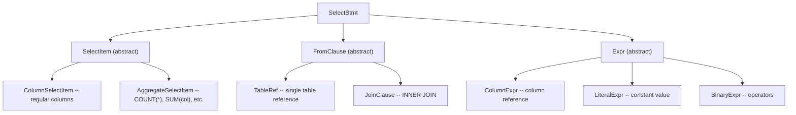
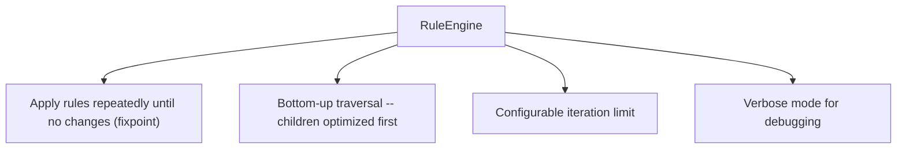
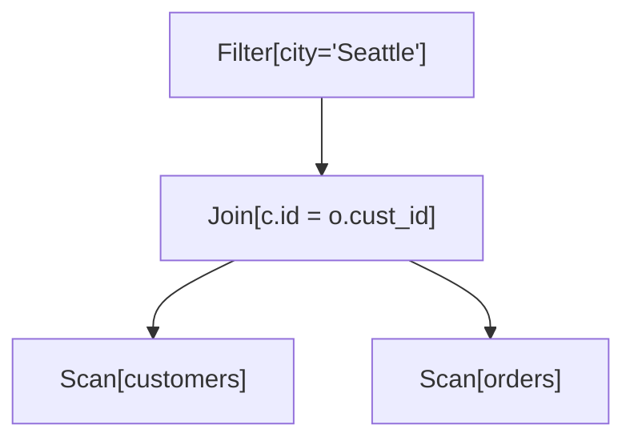
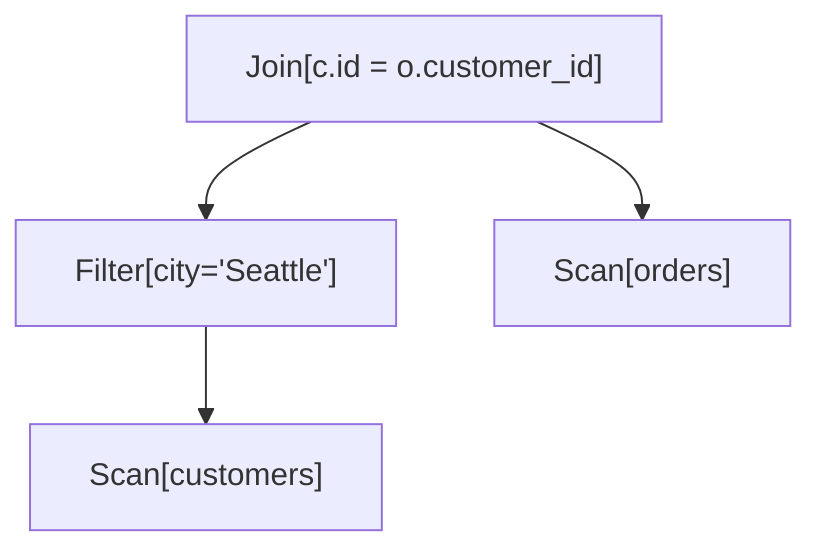
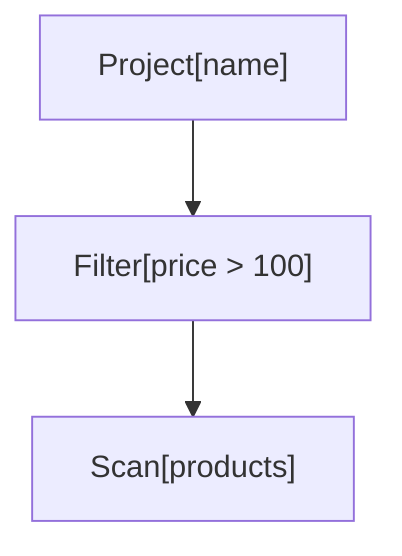
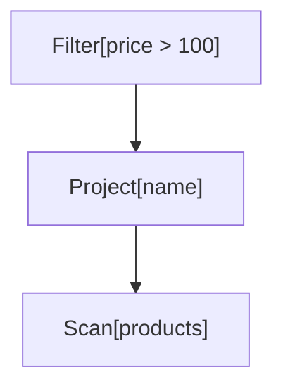
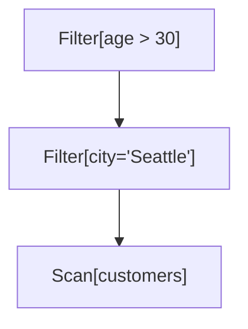
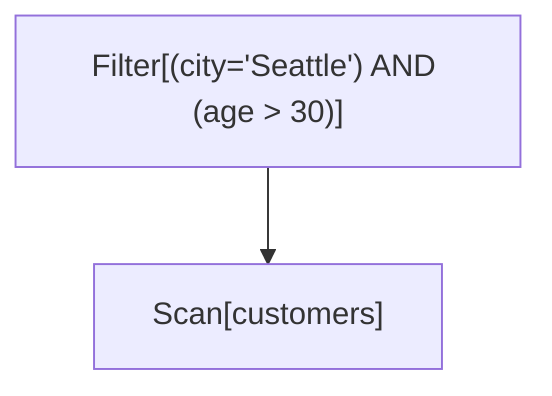
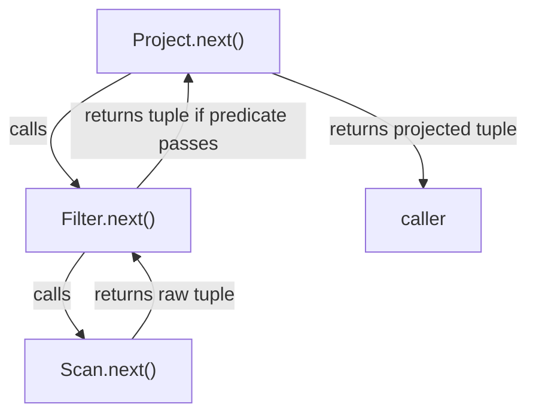

# Implementation walkthrough (Milestones 1–4)

This is the milestone-by-milestone build of the traditional optimizer, moved out of the top-level
[README](../README.md) to keep it focused. The code excerpts below illustrate the concepts; the source tree is
the authoritative reference where the two differ.

> **Note:** a few Milestone 4 snippets (the `Iterator`/`Executor`/`ExecutionResult` sketches) predate a later
> refactor that made execution pure. The executor now returns rows only — there is no `executionTimeMs` on
> `ExecutionResult` — and wall-clock latency is measured through a separate `ExecutionTimer` seam,
> `ExecutionTimer.run(() -> exec.execute(plan))`.

## Milestone 1: Foundation & Catalog

### Overview

Milestone 1 establishes the clean architectural foundation for the query optimizer. It implements the catalog layer,
core interfaces, and supporting infrastructure.

### Catalog System

**Key Features:**

- Central metadata registry for all tables
- CSV file loading with automatic schema detection
- Statistics collection (NDV, min/max, null counts)
- In-memory table storage

**Usage Example:**

```java
Catalog catalog = new Catalog();
TableMetadata customers = catalog.loadTableFromCSV("customers", "customers.csv");

// Query metadata
long rowCount = customers.getRowCount();
Schema schema = customers.getSchema();
ColumnStats stats = customers.getColumnStats("city");

// Access data
Object[] row = customers.getRow(0);
Object value = customers.getValue(0, "name");
```

**CSV Format:**

```
id:INTEGER,name:VARCHAR,age:INTEGER
1,Alice,30
2,Bob,25
```

### Core Interfaces

#### LogicalNode

Base class for logical plan operators with:

- Child management (`getChildren()`, `withChildren()`)
- Annotation system for optimizer metadata
- Pretty printing with cost/cardinality display

#### PhysicalNode

Base class for physical operators with:

- Similar structure to LogicalNode
- `estimateCost()` method for operator costing

#### Rule

Interface for optimization transformations:

```java
interface Rule {
    String getName();

    boolean matches(LogicalNode node);

    LogicalNode apply(LogicalNode node);
}
```

#### CostModel

Interface for cost and cardinality estimation:

```java
interface CostModel {
    double estimateCost(LogicalNode node);

    long estimateCardinality(LogicalNode node);

    CostConfig getConfig();
}
```

Includes configurable `CostConfig` with tunable constants:

- `PAGE_COST` - Cost to read/write a page
- `TUPLE_COST` - Cost to process a tuple
- `PAGE_SIZE` - Tuples per page

#### Iterator

Volcano-model execution interface:

```java
interface Iterator {
    void open();        // Initialize

    Object[] next();    // Get next tuple

    void close();       // Clean up
}
```

### Expression System

Shared expression tree for predicates and projections:

**Supported Expressions:**

- `ColumnRef` - Column references (qualified or unqualified)
- `Literal` - Integer, float, and string literals
- `BinaryOp` - Comparison (=, !=, >, <, >=, <=) and logical (AND, OR) operators

**Example:**

```java
// Build: age > 25 AND name = 'Alice'
Expression expr = new BinaryOp(Operator.AND,
                new BinaryOp(Operator.GT, new ColumnRef("age"), new Literal(25)),
                new BinaryOp(Operator.EQ, new ColumnRef("name"), new Literal("Alice"))
        );

// Evaluate against a row
Object result = expr.evaluate(row, schema);

// Generate SQL string
String sql = expr.toSqlString();  // "(age > 25) AND (name = 'Alice')"
```

### Plan Annotations

Both logical and physical nodes support annotations for optimizer metadata:

```java
node.setEstimatedRows(1000);
node.setEstimatedCost(25.5);
node.setAnnotation("selectivity", 0.1);

long rows = node.getEstimatedRows();
double cost = node.getEstimatedCost();
```

Pretty printing automatically displays annotations:

```
+-- Scan[products] [rows=7, cost=0.07]
```

## Milestone 2: Parsing & Logical Plans

### Overview

Milestone 2 implements SQL parsing, AST generation, and conversion to canonical logical plans. This establishes the
foundation for query optimization by creating a clean, normalized representation of queries.

### SQL Parser

**Supported SQL Syntax:**

```sql
SELECT column1, column2, aggregate(column)
FROM table1
    [INNER JOIN table2 ON condition]
    [INNER JOIN table3 ON condition]
WHERE condition
GROUP BY column1, column2
```

**Features:**

- Hand-written recursive descent parser
- Regex-based tokenization
- Support for qualified columns (table.column)
- Binary operators: =, !=, >, >=, <, <=
- Logical operators: AND, OR
- Aggregate functions: COUNT, SUM, AVG, MIN, MAX
- Literals: integers, floats, strings

**Explicitly NOT Supported:**

- Subqueries, UNION, DISTINCT
- Outer joins (LEFT, RIGHT, FULL)
- Complex expressions (arithmetic, functions, CASE)
- ORDER BY, LIMIT, HAVING

(Multi-way inner joins *are* supported: dynamic-programming join ordering handles up to 10 tables.)

### AST Classes

Complete Abstract Syntax Tree hierarchy in `AST.java`:



**Usage Example:**

```java
SQLParser parser = new SQLParser();
AST.SelectStmt ast = parser.parse("SELECT name FROM products WHERE price > 100");
System.out.println(ast); // Pretty-prints the AST
```

### Logical Operators

Five concrete logical operators representing relational algebra:

1. **LogicalScan** - Read from a table (leaf node)
2. **LogicalFilter** - Apply predicate (WHERE)
3. **LogicalProject** - Select columns (SELECT list)
4. **LogicalJoin** - Combine relations (JOIN)
5. **LogicalAggregate** - Group and aggregate (GROUP BY)

### LogicalPlanBuilder (Visitor Pattern)

Converts AST to logical plan with **canonical form enforcement**:

**Canonical Form Rules:**

1. **Split AND predicates** into separate Filter nodes
    - Input: `WHERE a = 1 AND b = 2 AND c = 3`
    - Output: 3 separate Filter nodes (one per predicate)
2. **Separate Filter nodes** from other operators
3. **Normalized expressions** (no redundancy)

**Why Canonical Form?**

- **Simplifies rules**: Each rule can assume a specific structure
- **Enables optimization**: Easier to move/reorder filters
- **Consistent representation**: Same query always produces same tree shape

**Example:**

```java
Catalog catalog = new Catalog();
catalog.loadTableFromCSV("products", "products.csv");

SQLParser parser = new SQLParser();
LogicalPlanBuilder builder = new LogicalPlanBuilder(catalog);

String sql = "SELECT name FROM products WHERE category = 'Electronics' AND price > 100";
AST.SelectStmt ast = parser.parse(sql);
LogicalNode plan = builder.build(ast);

// Plan structure (canonical form):
// Project[name]
// +-- Filter[(price > 100)]
//     +-- Filter[(category = 'Electronics')]
//         +-- Scan[products]
```

## Milestone 3: Rule Engine & Optimization

### Overview

Milestone 3 implements the core optimization engine: rule-based transformations, cost modeling, and cardinality
estimation. This is where query plans get transformed into more efficient equivalent plans.

### Rule Engine with Fixpoint Iteration

**Architecture:**



**Key Algorithm:**

```
while (not fixpoint && iterations < max) {
    for each rule:
        apply rule exhaustively to entire tree
    if (no changes):
        break  // fixpoint reached
}
```

**Usage:**

```java
List<Rule> rules = Arrays.asList(
        new PredicatePushdown(),
        new ProjectionPushdown(),
        new FilterMerge()
);

RuleEngine engine = new RuleEngine(rules, maxIterations);
LogicalNode optimizedPlan = engine.optimize(initialPlan);
```

### Optimization Rules

#### 1. Predicate Pushdown

**Pattern:** `Filter -> Join`
**Transform:** Push filter to appropriate join input

**Algorithm:**

1. Analyze which tables the predicate references
2. If predicate references only left table -> push to left child
3. If predicate references only right table -> push to right child
4. If predicate references both -> keep above join

**Before:**



**After:**



**Why it works:** For inner joins, filtering before or after produces same result, but filtering earlier reduces
intermediate result size.

#### 2. Projection Pushdown

**Pattern:** `Project -> Filter`
**Transform:** Swap to `Filter -> Project`

**Safety Check:**

- Ensure filter predicate doesn't reference columns eliminated by projection
- Only swap if safe

**Before:**



**After:**



**Why it works:** Filters don't change schema, and filtering first reduces data volume.

#### 3. Filter Merge

**Pattern:** `Filter -> Filter`
**Transform:** Single filter with AND predicate

**Before:**



**After:**



**Why it works:** Reduces operator overhead during execution. This reverses the canonical form after optimization is
complete.

### Cost Model

**Formula:**

```
Cost = I/O_cost + CPU_cost

I/O_cost  = pages_read * PAGE_COST
CPU_cost  = tuples_processed * TUPLE_COST

pages = ceil(rows / PAGE_SIZE)
```

**Configurable Parameters:**

```java
CostConfig {
    PAGE_COST = 1.0         // Cost to read one page
    TUPLE_COST = 0.01       // Cost to process one tuple
    PAGE_SIZE = 100         // Tuples per page
    COMPARISON_COST = 0.001 // Cost per comparison
    HASH_COST = 0.005       // Cost to hash one tuple
}
```

**Operator Costs:**

| Operator   | Formula                                                               |
|------------|-----------------------------------------------------------------------|
| Scan       | `pages(table) * PAGE_COST + rows * TUPLE_COST`                        |
| Filter     | `child_cost + rows * COMPARISON_COST`                                 |
| Project    | `child_cost + rows * TUPLE_COST`                                      |
| Join (NLJ) | `left_cost + right_cost + (left_rows * right_rows * COMPARISON_COST)` |
| Aggregate  | `child_cost + rows * HASH_COST`                                       |

**Usage:**

```java
CostModel costModel = new SimpleCostModel(catalog);

// Estimate cost
double cost = costModel.estimateCost(plan);

// Estimate cardinality
long rows = costModel.estimateCardinality(plan);

// Custom configuration
CostConfig config = new CostConfig(2.0, 0.02, 100);
CostModel customModel = new SimpleCostModel(catalog, config);
```

### Cardinality Estimation

**Techniques:**

**1. Scan Cardinality**

```
cardinality(Scan[T]) = |T|  (table row count)
```

**2. Filter Selectivity**

| Predicate Type    | Formula                                   |
|-------------------|-------------------------------------------|
| `col = value`     | `1 / NDV(col)`                            |
| `col != value`    | `1 - (1 / NDV(col))`                      |
| `col > value`     | `0.33` (heuristic)                        |
| `col < value`     | `0.33` (heuristic)                        |
| `pred1 AND pred2` | `sel(pred1) * sel(pred2)`                 |
| `pred1 OR pred2`  | `sel(pred1) + sel(pred2) - (sel1 * sel2)` |

```
cardinality(Filter) = input_rows * selectivity
```

**3. Join Cardinality**

For equality join `R.a = S.b`:

```
cardinality = (|R| * |S|) / max(NDV(a), NDV(b))
```

This assumes:

- Uniform distribution
- Independence
- Foreign key-like relationships

**4. Aggregate Cardinality**

```
cardinality(GroupBy[cols]) = min(input_rows, product of NDVs)
cardinality(no GROUP BY)   = 1
```

**Example:**

```java
CardinalityEstimator estimator = new CardinalityEstimator(catalog);

// Scan products (7 rows)
LogicalScan scan = new LogicalScan("products");
long scanCard = estimator.estimate(scan);  // 7

// Filter category='Electronics' (NDV=2, so selectivity=0.5)
Expression pred = ... // category = 'Electronics'
LogicalFilter filter = new LogicalFilter(pred, scan);
long filterCard = estimator.estimate(filter);  // ~3-4
```

## Milestone 4: Physical Execution

### Overview

Milestone 4 implements the **physical execution layer** that brings query plans to life. This completes the query
optimizer by adding the ability to actually execute queries and return results.

### Physical Operators

Complete implementation of the **Volcano iterator model**:

1. **PhysicalScan** - Sequential table scan
2. **PhysicalFilter** - Predicate evaluation
3. **PhysicalProject** - Column selection
4. **PhysicalNestedLoopJoin** - Nested loop join algorithm
5. **PhysicalHashJoin** - Hash join algorithm
6. **PhysicalAggregate** - Blocking GROUP BY / aggregation (COUNT/SUM/AVG/MIN/MAX)

All operators implement the `Iterator` interface:

```java
interface Iterator {
    void open();      // Initialize

    Object[] next();  // Get next tuple

    void close();     // Clean up
}
```

### Execution Engine

**Executor** - Runs physical plans and returns results

```java
Executor executor = new Executor();
ExecutionResult result = executor.execute(physicalPlan);

// Access results
List<Object[]> tuples = result.getTuples();
long timeMs = result.getExecutionTimeMs();
```

### Physical Plan Builder

**PhysicalPlanBuilder** - Converts logical to physical plans

- Chooses join algorithms (hash vs nested loop)
- Propagates schemas through operators
- Maintains cost annotations

### The Volcano Iterator Model

Each operator is an **iterator** that:

1. **Opens** - Initializes state, opens children
2. **Next** - Returns one tuple at a time
3. **Closes** - Releases resources

### Example: Filter Operator

```java
class PhysicalFilter implements Iterator {
    private Iterator child;
    private Expression predicate;

    void open() {
        child.open();  // Open child first
    }

    Object[] next() {
        while (true) {
            Object[] tuple = child.next();
            if (tuple == null) return null;

            if (predicate.evaluate(tuple)) {
                return tuple;  // Passes filter
            }
            // Otherwise try next tuple
        }
    }

    void close() {
        child.close();
    }
}
```

### Pipeline Execution

Operators **compose** naturally. Each `next()` call pulls lazily through the tree:



## Physical Plan Builder

### Logical to Physical Conversion

```java
PhysicalPlanBuilder builder = new PhysicalPlanBuilder(catalog);
PhysicalNode physical = builder.build(logicalPlan);
```

**Conversion rules:**

- `LogicalScan` -> `PhysicalScan`
- `LogicalFilter` -> `PhysicalFilter`
- `LogicalProject` -> `PhysicalProject`
- `LogicalJoin` -> `PhysicalHashJoin` (if equi-join) or `PhysicalNestedLoopJoin`

**Schema propagation:**

- Tracks schema through operator tree
- Needed for expression evaluation
- Ensures type safety

### Join Algorithm Selection

The algorithm is chosen per the `JoinAlgorithmPolicy` (see
[The Unified Optimizer Pipeline](../README.md#the-unified-optimizer-pipeline)). Under `COST_BASED`, an equi-join compares the
physical cost of a hash join (which scales with the *sum* of the input sizes) against a nested-loop join (which
scales with their *product*) and keeps the cheaper; `FORCE_HASH` / `FORCE_NLJ` override that choice. A non-equi join
always uses nested-loop.

```java
private PhysicalNode chooseJoinAlgorithm(LogicalJoin join, PhysicalNode left, PhysicalNode right, ...) {
    if (!isEquiJoin(join.getCondition())) {
        return new PhysicalNestedLoopJoin(...);          // hash join needs an equi-key
    }
    return switch (joinAlgorithmPolicy) {
        case FORCE_NLJ  -> new PhysicalNestedLoopJoin(...);
        case FORCE_HASH -> new PhysicalHashJoin(...);
        case COST_BASED -> costEstimator.hashJoinCost(left, right) <= costEstimator.nestedLoopJoinCost(left, right)
                ? new PhysicalHashJoin(...)
                : new PhysicalNestedLoopJoin(...);
    };
}
```

## Execution Engine

### Executor Class

```java
class Executor {
    ExecutionResult execute(PhysicalNode plan) {
        Iterator iter = (Iterator) plan;
        List<Object[]> results = new ArrayList<>();

        long start = System.currentTimeMillis();

        iter.open();
        Object[] tuple;
        while ((tuple = iter.next()) != null) {
            results.add(tuple);
        }
        iter.close();

        long time = System.currentTimeMillis() - start;

        return new ExecutionResult(results, time);
    }
}
```

### Execution Result

```java
class ExecutionResult {
    List<Object[]> tuples;        // Result data
    long executionTimeMs;          // How long it took
    long tuplesProcessed;          // Tuples examined

    int getResultCount();          // Rows returned
}
```

